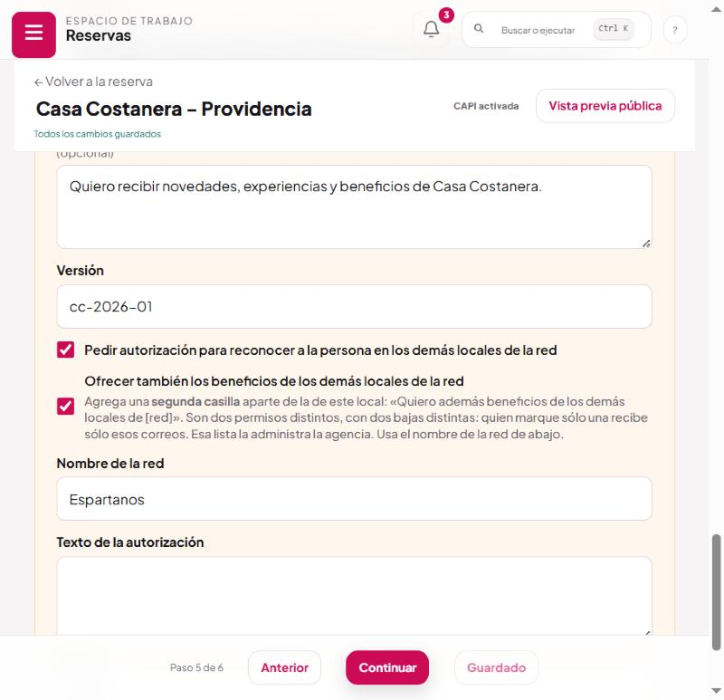
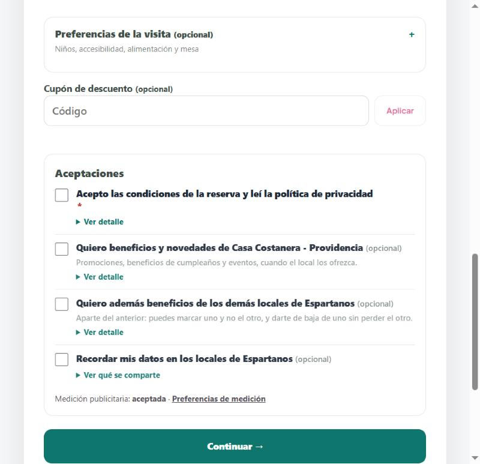
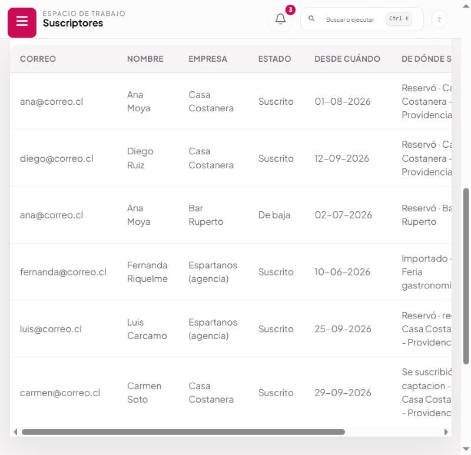
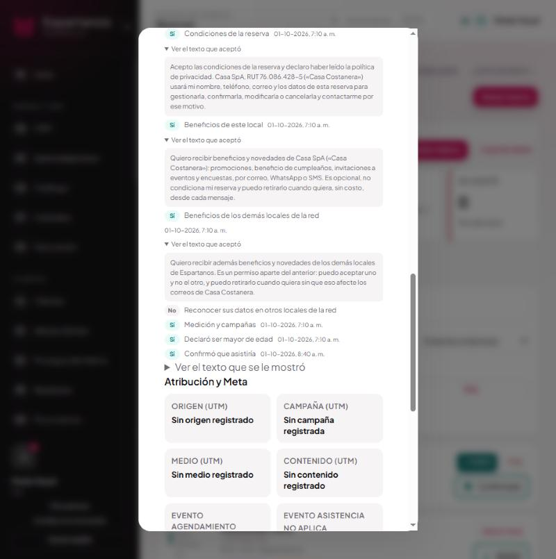

# Beneficios de la red

Cómo hacer que la página de reserva ofrezca, **aparte**, las promociones de los demás locales.
**Reservas → el local → paso «Datos y textos legales».**

Un local puede ofrecer dos cosas distintas a quien reserva: sus propias novedades, y las del resto
de la red. Son dos permisos, y desde ahora son dos casillas.

---

## 1 · Cómo se enciende



1. **Reservas** → abre el local → paso **Datos y textos legales**.
2. Marca **«Ofrecer también los beneficios de los demás locales de la red»**.
3. En **Nombre de la red**, escribe cómo se llama tu grupo —«Espartanos»—. Es el nombre que va a
   leer quien reserva: pon el que la gente reconoce, no la razón social.
4. **Guardar** y **publicar**.

La segunda casilla aparece sola en la página pública, debajo de la primera.

**Si no lo marcas, no pasa nada**: la página sigue mostrando sólo la casilla del local.

> **Ojo con la casilla de arriba.** «Pedir autorización para reconocer a la persona en los demás
> locales de la red» es **otra cosa** y ya existía. Ver el cuadro del punto 3.

---

## 2 · Qué ve quien reserva



Cuatro aceptaciones. La primera es obligatoria; las otras tres son opcionales e **independientes
entre sí**. Puede marcar una, dos, las tres o ninguna, y la reserva se hace igual en todos los
casos.

Cada una tiene su **«Ver detalle»**: el texto legal completo, el mismo que queda guardado.

---

## 3 · Las tres casillas opcionales, que es fácil confundir

| Casilla | Qué autoriza | Quién le escribe después | A qué lista entra |
|---|---|---|---|
| Beneficios de **este local** | Promociones, cumpleaños, eventos y encuestas de ese local | Casa Costanera | La del local |
| Beneficios de **los demás locales** | Que el **resto de la red** le escriba | Espartanos, por la red | **La de la agencia** |
| **Recordar mis datos** en los locales de la red | Que no le vuelvan a pedir el nombre y el teléfono al reservar en otro | **Nadie** | Ninguna |

La tercera ya existía y es la que más se confunde con la segunda. **No son lo mismo**: una es
comodidad al reservar, la otra es permiso para mandarle publicidad. Por eso están separadas, dicen
cosas distintas y se guardan por separado.

---

## 4 · Por qué son dos casillas y no una

Antes era una sola. Al encender la red, el texto de la casilla del local pasaba a decir *«de este
local **y sus locales**»*. Funcionaba, y tenía tres problemas que no se ven hasta que alguien
reclama:

| Problema | Qué significaba |
|---|---|
| **No se podía aceptar una sin la otra** | Quien quería las promociones de su local de siempre tenía que aceptar las de todos o quedarse sin ninguna. Un consentimiento que obliga a aceptar de más no es libre, y uno que no es libre no vale |
| **Quedaba un solo registro** | Si después preguntaban «¿yo autoricé que me escribiera Bar Ruperto?», la respuesta era una sola fecha y un solo texto para dos permisos distintos |
| **No se podía retirar uno sin el otro** | Darse de baja era darse de baja de todo, incluido el local donde sí quería seguir |

Ahora son dos casillas, dos textos, dos fechas y **dos bajas distintas**.

---

## 5 · Qué pasa por dentro cuando alguien marca

```
Marca la casilla del local     → ficha en la lista de Casa Costanera
Marca la casilla de la red     → ficha en la lista de la agencia (Espartanos)
Marca las dos                  → dos fichas, dos textos, dos tokens, dos bajas
```

Cada ficha guarda:

- El **texto exacto** que se mostró. Entero, no una versión: dentro de dos años «aceptó la v3» no le
  dice nada a nadie, y lo que hay que poder mostrar es lo que la persona leyó.
- La **fecha y hora**.
- Su **propio enlace de baja**, distinto del de la otra ficha.

**Antes de crear cualquiera de las dos** se consulta la lista de quienes pidieron no recibir más. Si
esa dirección está ahí, **no se crea nada**, aunque haya marcado la casilla
([manual 04](04-darse-de-baja.md)).

El alta **no puede romper la reserva**: va aparte y sin esperar. La reserva ya está confirmada, y
perderla por no poder escribir en la lista sería cambiar un problema pequeño por uno grave.

---

## 6 · Las tres vías por las que llega

La casilla aparece en los tres formularios públicos, y en los tres se guarda igual:

| Vía | Qué pasa |
|---|---|
| **Reserva normal** | Al confirmar, entra a la lista |
| **Lista de espera** | Igual: se guarda con la fila de espera |
| **Solicitud de grupo o evento** | Se guarda con la solicitud y **se hereda a la reserva** cuando el equipo la convierte |

La herencia importa: alguien que pidió un evento en marzo y lo cerró en mayo dio su permiso en
marzo, y esa es la fecha que vale.

---


*Luis Cárcamo entró por la casilla de la red: queda en «Espartanos (agencia)» con la procedencia «Reservó · red · Casa Costanera».*

---

## 7 · Quién puede escribirle a esa lista

La lista de la red es **de la agencia**, no de ningún local. Aparece en Marketing → Suscriptores
como «Espartanos (agencia)» y desde Campañas se elige como cualquier otra.

Esto resuelve algo que antes no tenía solución limpia: la agencia quería poder hablarle a quien se
interesa por toda la red, y la única lista disponible era la de cada local —cuyo permiso se dio a
ese local y a nadie más—. Ahora hay una lista con el permiso correcto, y se llena sola.

---

## 8 · Dónde queda cada cosa

| Qué | Dónde |
|---|---|
| El interruptor | `beneficiosDelGrupo` en el diseño del formulario |
| El nombre de la red | `networkBrandName` |
| En la reserva | `group_marketing_consent_at`, `_version`, `_text` |
| En la solicitud de grupo | `group_marketing_consent_at`, `_text` |
| La ficha | `email_subscribers` con `client_id` **vacío** (= agencia) y `source_detail = 'red · <local>'` |
| La versión del texto | `beneficios-red-v1` |

La ficha de una reserva muestra las cuatro aceptaciones con su fecha **y el texto que se aceptó**,
plegado. Se guardaba desde siempre y no se mostraba en ninguna parte.

### La ficha de la reserva: dónde se lee la prueba

**Reservas → Reservas → toca la reserva.** Abajo, en **«LO QUE ACEPTÓ»**:



Las siete aceptaciones con su **Sí/No** y la fecha exacta, y las que tienen texto guardado traen
**«Ver el texto que aceptó»**, plegado para que la ficha siga leyéndose de un vistazo.

Ésta es la pantalla que hay que abrir cuando alguien reclama. El texto se guardaba entero desde
siempre y **no se mostraba en ninguna parte**: guardar la prueba sin poder leerla no sirve.

**El texto no lo puede redactar el local.** El de la casilla del local sí se personaliza desde el
constructor; el de la red no, porque un local no puede redactar en qué términos un tercero va a
tratar datos de los que ese tercero será responsable.

---

## 9 · A qué ley responde

**Ley 21.719, consentimiento específico.** Tiene que ser *libre, específico, informado e
inequívoco*, y referirse a **finalidades determinadas**. «Que me escriba este local» y «que me
escriban otros locales» son dos finalidades y dos responsables distintos; meterlas en una casilla
las vuelve una sola cosa que la persona no puede separar.

**Ley 21.719, revocación.** Retirar el consentimiento debe ser tan fácil como darlo. Con un solo
registro para dos permisos, retirar uno era imposible sin retirar el otro.

**Ley 21.719, información al titular.** El texto de la red nombra expresamente **a quién se le
entregan los datos** y **quién responde de esa lista**. Quien acepta tiene que poder entender a
quién le está abriendo la puerta.

**Ley 19.496, art. 28 B.** Cada correo de cualquiera de las dos listas lleva su enlace de
suspensión, y son enlaces distintos porque son listas distintas.

---

## 10 · Preguntas que van a salir

**¿Y los que ya habían aceptado con la casilla antigua?**
Se quedan como están, en la lista de su local, con el texto que realmente se les mostró. **No se
les pasó a la lista de la red.** Deducir de aquel texto un permiso que nadie marcó por separado
sería inventar consentimiento.

**¿Puedo cambiar el texto de la casilla de la red?**
No. El del local sí, desde el constructor.

**Si alguien se da de baja de la red, ¿deja de recibir de su local?**
No. Son listas separadas con bajas separadas. La página de baja se lo explica y le ofrece el botón
para salir de todas si eso es lo que quiere.

**¿Sirve para WhatsApp o SMS?**
El texto los menciona porque el permiso los cubre, pero hoy el sistema sólo manda correo.

**Encendí el interruptor y la casilla no aparece.**
Hay que **publicar** después de guardar. Y comprueba que no estés mirando la vista previa de una
versión anterior.

**¿Aparece en la encuesta pública?**
No. Las casillas de marketing sólo salen en los formularios de reserva.
