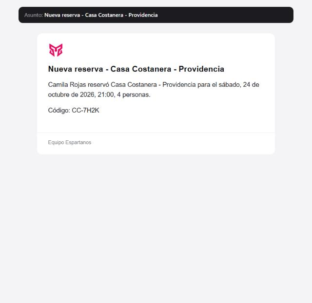
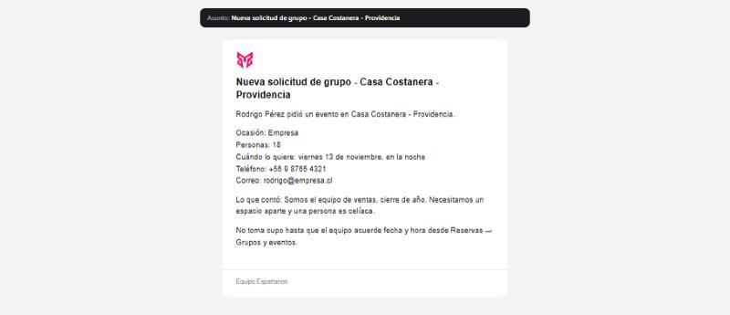
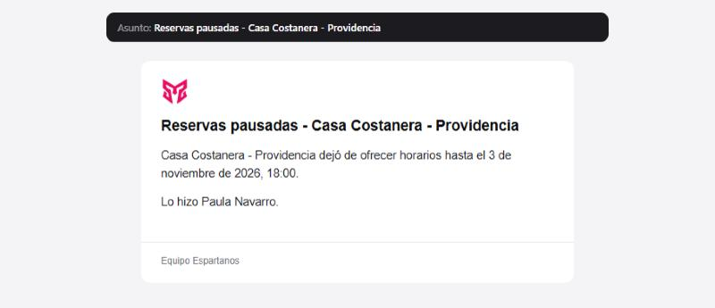

# Casillas del equipo

Quién del equipo recibe cada aviso, sin necesidad de que tenga cuenta en el sistema.
**Reservas → el local → paso «Datos y textos legales».**

Un garzón, una cajera o la barra no tienen por qué tener usuario: reciben un correo y hacen su
trabajo. Esta tabla es donde se anotan, y donde se decide **qué le toca a cada uno**.

---

## 1 · La tabla


Cada fila es una casilla; cada columna, un tipo de aviso. Debajo, el formulario para agregar a
alguien nuevo.

---

## 2 · Los seis avisos, y qué lleva cada uno

| Tipo | Cuándo sale | Qué lleva dentro |
|---|---|---|
| **Reserva nueva** | Alguien reserva | Nombre, cuántos vienen, día y hora, código |
| **Solicitud de grupo o evento** | Alguien pide un evento, o viene con 9+ | Todo lo anterior **más teléfono, correo y lo que contó** |
| **Lista de espera** | Alguien se anota para un horario lleno | Nombre, cuántos, para cuándo |
| **El cliente canceló o cambió la hora** | Quien reservó lo cambia desde su enlace | Qué reserva, la hora nueva y la anterior |
| **Mensaje en una encuesta** | Alguien escribe algo al responder | La nota, el mensaje y su correo si lo dejó |
| **Reservas pausadas o día cerrado** | Se pausan las reservas o se cierra un día | Qué pasó, en qué local y quién lo hizo |

### Por qué esto importa: mira los dos correos

**Reserva nueva** — lo que necesita el turno para preparar la mesa:



**Solicitud de grupo** — lo que necesita quien va a llamar para cerrar el evento:



El segundo lleva **el teléfono, el correo y las notas** de quien pidió el evento, incluida una
mención a que una persona es celíaca. Un garzón no necesita nada de eso para saber que a las nueve
entran seis personas — y antes lo recibía igual, porque la lista era una sola y recibía todo.

### El aviso que antes no salía



Pausar las reservas o cerrar un día existía **sólo como campana dentro de la aplicación**. Quien no
tiene cuenta —el turno que atiende— no se enteraba de que esa noche no entraba nadie hasta que la
noche había pasado. Es el aviso que más cuesta no recibir, y era el único que no salía del sistema.

Quien hizo el cambio **no se avisa a sí mismo**.

---

## 3 · Agregar a alguien, paso a paso

1. **Reservas** → abre el local → paso **Datos y textos legales**.
2. Baja hasta **«Quién del equipo recibe cada aviso»**.
3. Escribe el **correo**. Es lo único obligatorio.
4. **Nombre y cargo** son opcionales, pero ponlos: dentro de seis meses, `mesones@` sin cargo no le
   dice a nadie si se puede borrar.
5. Marca los **avisos** que le tocan.
6. **Agregar al equipo**.

**Para cambiarle los avisos a alguien que ya está**, marca o desmarca su casilla en la tabla. Se
guarda al momento, sin botón.

**Quitar todas las marcas es válido** y no borra la fila. Es lo que se hace con quien está de
vacaciones: deja de recibir, y vuelve a activarse sin pedirle otra vez la dirección.

**Quitar** elimina la casilla. Los correos que ya salieron quedan registrados igual.

### Qué rechaza, y qué dice

| Si… | El mensaje |
|---|---|
| El correo no tiene forma de correo | «La dirección de correo no es válida» |
| Agregas a alguien que ya está | **No falla**: corrige la fila que ya existía. El error que se comete es volver a agregar a alguien para cambiarle los avisos, y un choque de clave única ahí no explica nada |

---

## 4 · El campo antiguo, el de arriba

En el mismo paso, más arriba, sigue el campo **«3. A quién se avisa de cada reserva nueva»** con los
correos separados por coma.

**Esas direcciones reciben los seis avisos.** No se tocaron a propósito: apagarle avisos en silencio
a alguien que los venía recibiendo es peor que no cambiar nada.

Para repartir, pasa esas direcciones a la tabla de abajo y bórralas de arriba. Mientras estén en las
dos, reciben desde arriba —todo— y la tabla no les quita nada.

---

## 5 · Cómo se decide a quién le llega

```
Pasa algo en el local (reserva, evento, pausa…)
   ↓
¿Hay usuarios con cuenta en esa empresa?
   └── sí → campana dentro de la aplicación
   ↓
Casillas del local marcadas con ese tipo de aviso
   +  direcciones del campo antiguo del formulario  (reciben todos los tipos)
   ↓
¿Está encendido el aviso en Correos?
   └── no → no sale el correo. La campana sí salió.
   ↓
¿Queda alguna dirección?
   └── no → no sale nada. Nunca se cae hacia un destinatario por defecto:
            escribirle a quien no corresponde es peor que no escribir.
   ↓
Sale el correo
```

Las direcciones se piden **una sola vez y en un solo sitio**. Antes cada aviso las sacaba por su
cuenta —uno del formulario, el de encuestas con una consulta propia, y el de pausa de ningún
sitio—, así que «a quién le llega esto» no se podía responder sin leer seis archivos.

---

## 6 · Quién puede mantener esta tabla

| Cargo | Qué puede |
|---|---|
| Administración, Dirección Comercial, Dev | El equipo de cualquier local que tengan asignado |
| **La cuenta de la empresa** | **El equipo de su propio local, y ninguno más** |

Que la empresa pueda mantener el suyo es deliberado: es **su** equipo, y pedirle a la agencia que
agregue a cada garzón nuevo es lo que hace que la lista quede vieja.

El servidor comprueba **tres cosas** antes de dejar tocar nada:

1. El **cargo** de quien lo pide.
2. Que la cuenta **alcance** esa empresa.
3. Que esa empresa **tenga Reservas contratado**.

La tercera faltaba y se añadió después: esta pantalla nombra la empresa con `empresa=` y no con
`clientId=`, así que el guardia central no la veía y para una cuenta de la agencia la comprobación
se saltaba. Esconder la pantalla no es cerrarla.

---

## 7 · Dónde queda cada cosa

| Qué | Dónde |
|---|---|
| La casilla | Tabla `team_notification_recipients`: correo, nombre, cargo, tipos, **quién la agregó** y cuándo |
| Las direcciones antiguas | `team_notifications`, columna JSON del formulario de reservas |
| El texto de cada aviso | Ajustes de Correos, claves `email.team_*` |
| Si el aviso está encendido | `email.team_*_enabled` |

Una dirección por local: la misma persona puede estar en dos locales con avisos distintos en cada
uno.

| Acción | Endpoint |
|---|---|
| Tipos de aviso | `GET /avisos/destinatarios/tipos` |
| Listar | `GET /avisos/destinatarios?empresa=…` |
| Anotar o corregir | `POST /avisos/destinatarios?empresa=…` |
| Quitar | `DELETE /avisos/destinatarios/:id?empresa=…` |

### Los interruptores de Correos

| Aviso | Clave | De fábrica |
|---|---|---|
| Reserva nueva | `email.team_new_reservation_enabled` | Encendido |
| Solicitud de grupo | `email.team_group_request_enabled` | Encendido |
| Lista de espera | `email.team_waitlist_enabled` | Encendido |
| El cliente canceló | `email.team_guest_cancel_enabled` | Encendido |
| El cliente cambió la hora | `email.team_guest_reschedule_enabled` | Encendido |
| Mensaje en una encuesta | `email.team_survey_message_enabled` | Encendido |
| Reservas pausadas o día cerrado | `email.team_operation_enabled` | Encendido |

Todos tienen además su **asunto** y su **cuerpo** editables, con las variables listadas en la
descripción de cada uno.

---

## 8 · A qué ley responde

**Ley 21.719, minimización.** Los datos tratados deben ser *adecuados, pertinentes y limitados a lo
necesario* para la finalidad. Mandar el teléfono de un cliente a seis personas cuando una sola lo va
a llamar no es «limitado a lo necesario». Repartir por tipo es cómo se cumple esto en la práctica,
y el correo de la solicitud de grupo de más arriba es el ejemplo de por qué hacía falta.

**Ley 21.719, responsabilidad proactiva.** Hay que poder demostrar que se cumple. Saber quién agregó
cada dirección del equipo y cuándo es parte de eso.

**Los correos de los trabajadores también son datos personales.** Se tratan sobre la base de la
relación laboral y para una finalidad concreta —avisarles de su trabajo—. Por eso la tabla guarda el
cargo: permite entender a quién se le está quitando algo antes de quitarlo.

**Estos correos no llevan enlace de baja, y es correcto.** El artículo 28 B habla de comunicaciones
*promocionales o publicitarias*. Un aviso de que entró una reserva no lo es, y un enlace de baja ahí
dejaría que alguien se apagara los avisos de su propio turno.

---

## 9 · Preguntas que van a salir

**¿La misma persona puede estar en dos locales?**
Sí, con avisos distintos en cada uno.

**Si quito a alguien, ¿pierdo el historial?**
No. Los correos que ya salieron quedan en el registro de envíos.

**¿Hay que poner también a los usuarios con cuenta?**
No hace falta: ya reciben la campana dentro de la aplicación. Agrégalos sólo si además quieres que
les llegue por correo.

**¿Por qué no puedo inventar un tipo de aviso nuevo?**
Porque cada tipo corresponde a un correo que existe. Un tipo que no corresponde a nada sería una
casilla que no hace nada, que es justo lo que se vino a corregir.

**Agregué a alguien y no le llega nada.**
Tres cosas, en orden: que tenga marcado ese tipo; que el aviso esté encendido en Correos; y que el
local sea el correcto —la tabla es del local, y si tienes dos locales puedes estar mirando el otro—.

**¿Puedo poner una lista de distribución del local (`equipo@`)?**
Sí. El sistema manda a la dirección que le pongas; lo que pase después es cosa de tu servidor de
correo. Ten en cuenta que entonces el reparto por tipo lo pierdes dentro de esa lista.
