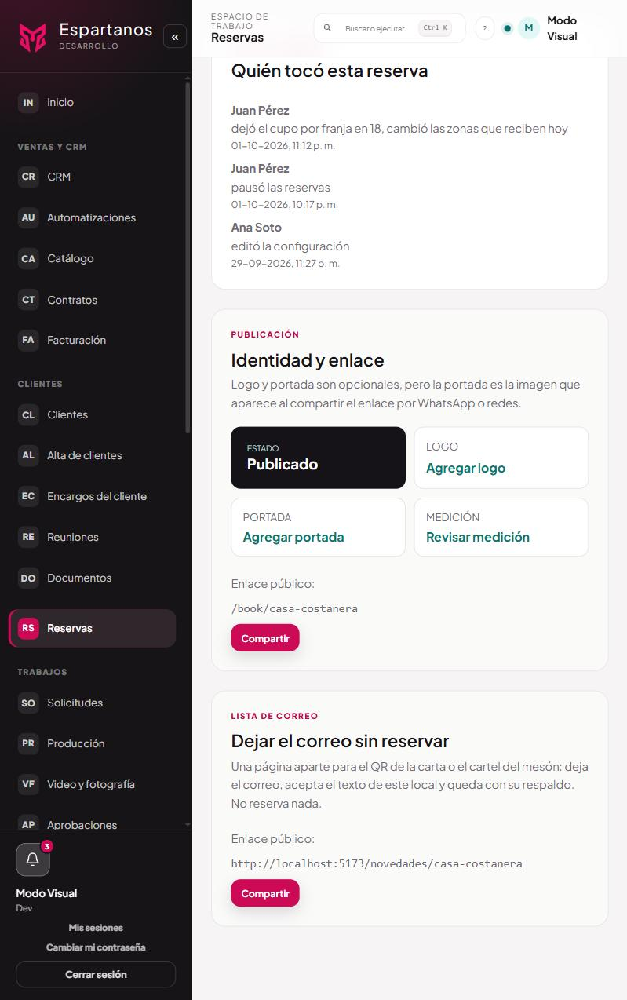
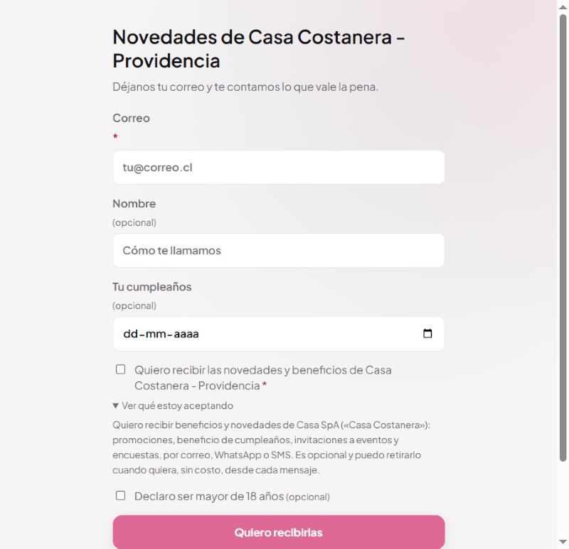
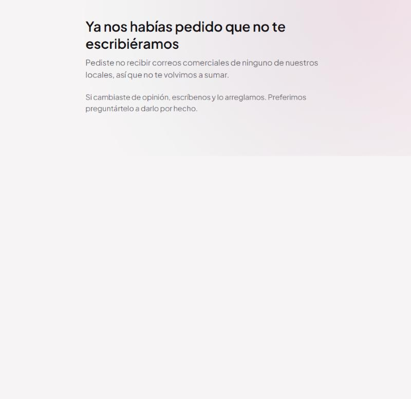

# Suscribirse sin reservar

El enlace y el QR para que alguien entre a tu lista sin tener que reservar.
**Reservas → el local → paso «Publicar».**

Sirve para el QR de la carta, el cartel del mesón, el pie de la boleta o el perfil de Instagram:
sitios donde la persona **ya está dentro** y pedirle que reserve no viene a cuento.

---

## 1 · Dónde está el enlace

Debajo del enlace de reservas, con sus propios botones. Está aparte a propósito: son dos puertas
distintas. La de arriba lleva a tomar una mesa; ésta sólo recoge el correo de quien quiere
enterarse.

**Aparece cuando el local está publicado.** Antes de publicar no existe, porque la página pública
tampoco.

La dirección es `https://cuartel.espartanos.cl/novedades/<nombre-corto-del-local>`.

### Para hacer el QR

1. **Copiar** el enlace.
2. Pásalo por cualquier generador de QR.
3. Imprímelo en la carta, el mesón o donde vaya.

**Este enlace todavía no tiene generador de QR dentro del sistema.** Encuestas sí lo tiene
—«Compartir» → «Código QR», con Descargar PNG e Imprimir—, y lo razonable es que esta pantalla
acabe teniendo el mismo. Está anotado como pendiente.

Mientras tanto, hacerlo fuera tampoco es un mal apaño: un QR es una imagen que se imprime una vez y
vive dos años en una carta, así que conviene montarlo con la herramienta de diseño que uses para la
carta, al tamaño y con el logo que corresponda.

**El enlace no cambia nunca** mientras no cambies el nombre corto del local. Si lo cambias, el QR
impreso deja de funcionar.

---

## 2 · Qué ve la persona

| Campo | Obligatorio | Para qué |
|---|:--:|---|
| **Correo** | Sí | Es lo que hace falta para la finalidad |
| Nombre | No | Para saludar: `{{nombre}}` en los correos |
| Tu cumpleaños | No | Sólo sirve si el local manda el beneficio de cumpleaños |
| **Quiero recibir las novedades** | **Sí** | El consentimiento |
| Declaro ser mayor de 18 años | No | Deja constancia de que se preguntó |

**El botón no se habilita** hasta que haya un correo con forma de correo **y** la casilla marcada.

**«Ver qué estoy aceptando»** despliega el texto legal completo. No es un enlace a otra página: es
el texto, ahí mismo, porque lo que hay que poder demostrar después es lo que la persona tenía
delante cuando aceptó.

**El cumpleaños se pide y no se exige.** Exigirlo para suscribirse sería pedir un dato que no hace
falta para la finalidad.

---

## 3 · Qué pasa al enviar

| Si… | La página dice | Qué guarda |
|---|---|---|
| Es alguien nuevo | «Listo. Vas a recibir las novedades de…» | Ficha nueva, suscrita |
| Ya estaba suscrito | «Listo» igual | Completa lo que faltaba (nombre, cumpleaños) |
| Estaba en «pendiente» | «Listo» | **Pasa a suscrito**: ahora sí dijo que sí |
| **Pidió no recibir antes** | Ver abajo | **Nada** |
| Es un robot (campo trampa lleno) | «Listo» | **Nada** |

### El caso que importa

Si esa dirección pidió no recibir más, **no se la vuelve a suscribir**, y la página se lo dice en
vez de fingir que la sumó. Si de verdad cambió de opinión, le pide que escriba: *«Preferimos
preguntártelo a darlo por hecho»*.

El texto cambia según el alcance de lo que pidió —«de ninguno de nuestros locales» o «de este
local»—, porque no es lo mismo y la persona tiene derecho a saber qué consta.

### Qué se guarda de cada alta

| Dato | De dónde sale |
|---|---|
| El **texto exacto** que se mostró | Lo genera el servidor |
| La **fecha y hora** | El momento del envío |
| La **dirección IP** | De la petición |
| Si **declaró ser mayor de edad** | La casilla, guardada como instante |
| La **procedencia** | `captación · <nombre del local>` |
| El **token** de su enlace de baja | Aleatorio, 24 bytes |

En la lista aparece como **«Se suscribió»**, distinto de «Reservó» y de «Importado».

---

## 4 · Por qué el texto lo pone el servidor

El texto que la persona acepta **no lo escribe la página**. Lo genera el servidor con la identidad
legal del local —razón social, RUT, correo de privacidad— y la página sólo lo muestra.

La razón es simple: cualquiera puede abrir las herramientas del navegador y cambiar lo que una
página muestra. Si el texto viajara desde el navegador al guardarse, la «prueba» del consentimiento
sería un texto que el propio interesado pudo haber modificado. **El texto es la prueba**, así que
tiene que venir de donde no se puede tocar.

Es el **mismo texto** que usa la casilla de la página de reserva. Una sola fuente: si cambia la
razón social del local, cambia en los dos sitios a la vez.

---

## 5 · Las defensas que tiene

| Defensa | Qué hace |
|---|---|
| **Campo trampa** | Invisible para una persona —fuera de la pantalla y oculto a los lectores de pantalla—, irresistible para un robot. Si llega lleno, la página responde que todo salió bien y **no guarda nada**. Decirle que fue rechazado le enseña a reintentar de otra forma |
| **Tres envíos por minuto** | El límite más estricto de todo el sistema público |
| **Consulta de exclusión** | Antes de crear nada |
| **Correo normalizado** | En minúsculas y sin espacios, para que `Ana@x.cl` y `ana@x.cl` no entren como dos personas |

El límite es el más estricto porque éste es **el único sitio donde se crea un dato personal a partir
de una sola dirección de correo**. Sin freno, serviría para averiguar si una persona está en el
sistema probando direcciones, o para llenar la lista con correos ajenos.

---

## 6 · Dónde queda cada cosa

| Qué | Dónde |
|---|---|
| La ficha | `email_subscribers`, con `source = 'captacion'` |
| El texto aceptado | `consent_text`, entero |
| La IP | `consent_ip` |
| La mayoría de edad | `adult_declared_at` |

| Acción | Endpoint | Límite |
|---|---|---|
| Qué mostrar | `GET /public/reservations/:slug/captacion` | 60/min |
| Suscribirse | `POST /public/reservations/:slug/suscribirse` | **3/min** |

Las dos son públicas y sin sesión.

**Vive dentro de Reservas** —y no en Marketing— porque la identidad legal del local es la que el
formulario de reservas ya tiene completa, y es la que el texto de consentimiento tiene que nombrar.
Una página de captación con su propia copia de esos datos sería tener dos versiones de la misma
verdad legal, y la segunda se queda vieja.

---

## 7 · A qué ley responde

**Ley 19.496, art. 28 B.** Todo lo que salga de esta lista llevará identificación del remitente y
enlace de suspensión. La página lo anuncia **antes** de pedir el dato: *«Cada correo lleva abajo un
enlace para dejar de recibirlos, y funciona sin tener cuenta»*. Decirlo antes es parte de informar.

**Ley 21.719, consentimiento informado.** El texto está a la vista, en la misma pantalla, antes de
aceptar. Una casilla premarcada o un texto escondido detrás de tres clics no cumplen con
«informado». **La casilla nace desmarcada**: un consentimiento premarcado no es consentimiento.

**Ley 21.719, licitud del origen.** La procedencia queda escrita en cada ficha. Es lo que permite
responder a «¿de dónde sacaron mi correo?» con una frase concreta.

**Ley 21.719, minimización.** Se piden tres datos y dos son opcionales.

**El art. 28 B manda sobre una casilla marcada después.** Por eso la exclusión se consulta antes de
crear la ficha: pedida la suspensión, los envíos *«quedarán desde entonces prohibidos»*, y una
casilla marcada en otra página no es la misma persona diciendo expresamente que cambió de opinión.

---

## 8 · Preguntas que van a salir

**¿Puedo tener un enlace por cada sitio, para saber cuál funciona?**
Hoy no: todos quedan con la misma procedencia. Si te hace falta distinguir la carta del mesón, dilo
y se puede agregar.

**¿Sirve para la lista de la agencia?**
No: el enlace es de un local y la ficha entra a la lista de ese local. Para la de la agencia está la
casilla de la red en la página de reserva ([manual 01](01-beneficios-de-la-red.md)).

**¿Qué pasa si alguien pone el correo de otra persona?**
Esa persona recibirá el primer correo con su enlace de baja y podrá salirse en un clic, sin cuenta.
Es el motivo por el que el enlace de baja no exige identificarse.

**¿Puedo cambiar el texto de la página?**
El texto legal no. El nombre del local sale del formulario de reservas, así que cambiándolo ahí
cambia aquí.

**¿Se puede usar el mismo QR para dos locales?**
No. Cada local tiene su enlace porque cada ficha entra a **su** lista, con **su** permiso.

**Alguien dice que se suscribió y no está en la lista.**
Lo más probable: había pedido no recibir antes. Consúltalo en las exclusiones
([manual 06](06-suscriptores-y-exclusiones.md)).
