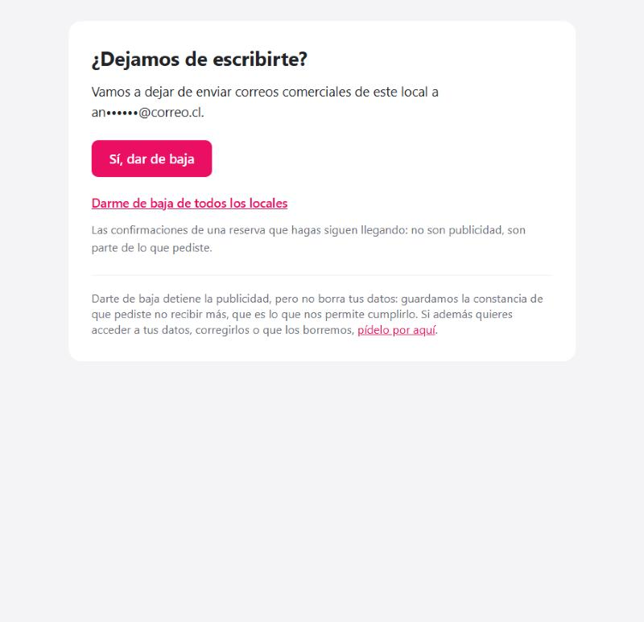
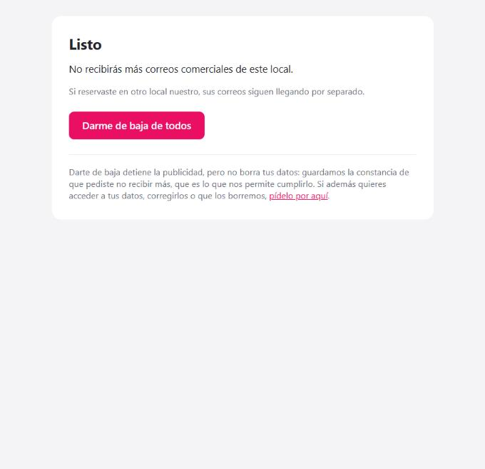

# El camino de salida

Cómo se da de baja alguien, qué pasa después, y qué guarda el sistema para poder cumplirlo.
No se configura: funciona solo en todo correo comercial.

Es la parte del sistema que más decide si tus correos llegan. Quien no encuentra cómo salirse
marca el mensaje como spam, y eso no le hace daño a esa campaña: se lo hace a todos los correos de
todos los locales a la vez, durante meses.

---

## El camino completo

```
Correo comercial
│
├─ Pie del mensaje: «Dar de baja»
└─ Botón de Gmail/Yahoo junto al remitente: «Anular suscripción»
        │
        ▼
   Página de confirmación          ← el enlace NO da de baja al abrirlo
   ¿Dejamos de escribirte?
   an•••••@correo.cl
   [ Sí, dar de baja ]            → sólo de este local
   Darme de baja de todos         → de todos, y queda anotado para siempre
        │
        ▼
   Listo
   └─ al pie: «¿También quieres que borremos tus datos?» → /solicitudes
```

---

## Lo que ve quien hace clic


*El correo va a medias: la página es pública y puede quedar abierta a la vista de otro. Los dos caminos, desde el primer momento.*


*Confirmado, con la salida completa todavía a mano y el canal de derechos al pie.*

---

## Por qué el enlace pregunta antes

Abrir el enlace **no da de baja a nadie**. Muestra una página con un botón, y la baja ocurre al
apretarlo.

Parece un paso de más. No lo es: **Outlook y los antivirus de correo abren los enlaces de un
mensaje para revisarlos antes de dejártelo ver.** Con la baja colgada de la simple apertura del
enlace, esos escáneres daban de baja a personas que nunca hicieron clic.

Y eso no se arregla después. El artículo 28 B dice que, pedida la suspensión, los envíos siguientes
*«quedarán desde entonces prohibidos»*: el sistema no puede volver a suscribir a alguien por su
cuenta, ni aunque sepa que fue un error. Una baja equivocada es definitiva.

El botón resuelve el problema sin poner ningún obstáculo real: sigue siendo un clic desde el
correo, sin contraseña y sin formulario.

---

## Los dos alcances, y por qué los dos están a la vista

| Botón | Qué hace |
|---|---|
| **Sí, dar de baja** | Sale de la lista de **ese local**. Los demás locales siguen escribiéndole por separado. |
| **Darme de baja de todos** | Sale de **todas** las listas de la organización, y queda anotado en la lista de exclusión. |

Los dos aparecen desde el primer momento, no escondiendo el segundo detrás del primero.

El motivo es práctico antes que legal: quien está molesto y no encuentra cómo salirse del todo usa
«marcar como spam». Ofrecer la salida completa en el mismo sitio convierte una queja formal ante
Gmail en una baja limpia.

El motivo legal es que la baja por local corresponde a cómo están repartidos los permisos: cada
local es responsable distinto de sus datos y el permiso se le dio a cada uno por separado. Pero
alguien puede querer salirse de todo de una vez, y eso tiene que poder hacerse en un clic.

---

## Qué se guarda, y qué no

Al darse de baja se guardan dos cosas distintas:

**En su ficha:** la fecha, el alcance (este local / todos) y desde qué correo pidió la baja. Del
alta se guardaba todo —origen, texto aceptado, fecha, IP— y de la baja sólo la fecha; si alguien
reclama que siguió recibiendo, hay que poder demostrar qué pidió y cuándo.

**En la lista de exclusión:** una **huella** de su correo. No el correo: un código irreversible
calculado a partir de él. Sirve para una sola cosa —responder «¿a esta dirección le prohibí
escribir?» cuando ya se tiene la dirección por otra vía— y no se puede listar ni revertir.

Esa huella es lo que hace que la prohibición sobreviva al borrado de los datos. Si alguien pide que
le borren todo, se borra todo **menos** el hecho de que pidió no recibir más: sin eso, la siguiente
reserva volvería a meterlo en la lista y se incumpliría el artículo 28 B.

---

## Qué NO hace darse de baja

Lo dice la propia página, al pie:

> Darte de baja detiene la publicidad, pero no borra tus datos: guardamos la constancia de que
> pediste no recibir más, que es lo que nos permite cumplirlo. Si además quieres acceder a tus
> datos, corregirlos o que los borremos, pídelo por aquí.

Son dos puertas y conviene que se vean distintas. La baja detiene el correo comercial. El borrado
de datos se pide en **/solicitudes** y tiene su propio procedimiento y sus propios plazos legales
([manual 08](08-solicitudes-de-derechos.md)).

**Lo que sigue llegando después de una baja:** la confirmación de una reserva que haga, el
recordatorio de esa reserva, el enlace para gestionarla. No son publicidad: son parte del servicio
que pidió.

---

## El botón de Gmail y Yahoo

Además del enlace del pie, el correo lleva dos cabeceras técnicas que hacen que Gmail y Yahoo
muestren su **propio** botón de «Anular suscripción» junto al nombre del remitente, sin abrir el
mensaje.

Ese botón es el que evita la mayoría de los reportes de spam: está donde la persona ya está
mirando, y es más fácil que buscar el enlace al final del correo.

**Que la cabecera esté no garantiza que el botón aparezca.** Gmail y Yahoo deciden mirando además:

| Factor | Qué significa |
|---|---|
| **Reputación del dominio** | Tu historial de quejas. El umbral de Gmail es **menos del 0,3%** de reportes de spam. Por encima degradan todo, no sólo el botón. |
| **Autenticación** | SPF, DKIM y **DMARC** alineados. Sin DMARC publicado, un remitente de volumen está en la categoría con menos privilegios. |
| **Volumen y constancia** | A un remitente nuevo o esporádico lo tratan con desconfianza hasta que acumula historial. |
| **Que la baja funcione** | Si el botón falla al usarlo, dejan de confiar en la cabecera. |

O sea: puede tardar días o semanas en aparecer y no significa que esté mal puesto.

---

## A qué ley responde

**Ley 19.496, art. 28 B.** Es la norma central. Exige que todo mensaje promocional indique quién lo
manda y contenga *«una dirección válida a la que el destinatario pueda solicitar la suspensión de
los envíos»*, y que una vez solicitada *«quedarán desde entonces prohibidos»*. De ahí salen tres
cosas: el enlace en cada correo, que funcione sin cuenta, y que la prohibición no caduque.

**Ley 21.719, revocación del consentimiento.** Retirar el consentimiento tiene que ser tan fácil
como darlo. Si darlo fue marcar una casilla al reservar, retirarlo no puede exigir iniciar sesión,
escribir un correo o rellenar un formulario.

**Ley 21.719, derecho de supresión, y cómo convive con lo anterior.** Las dos obligaciones parecen
chocar: una dice «recuerda que te pidió no escribirle», la otra «bórralo si te lo pide». Se
concilian porque lo que se conserva es una huella irreversible y no la dirección: es el mínimo
necesario para cumplir un deber legal, que es la excepción que hace que la supresión no lo alcance.

**Reglas de Gmail y Yahoo (febrero 2024).** No son ley, pero deciden si tu correo llega. Exigen
baja de un clic desde el cliente de correo para quien manda en volumen.

---

## Preguntas que van a salir

**Alguien dice que se dio de baja y sigue recibiendo. ¿Cómo lo compruebo?**
Marketing → Suscriptores → al pie, **«Pidieron no recibir más»**. Escribe su correo y consulta.
Ver [el manual 06](06-suscriptores-y-exclusiones.md).

**Me llegó un aviso del SERNAC. ¿Qué hago?**
Misma pantalla, botón **«Anotar una petición recibida por fuera»**. Tienes **siete días** para
cumplirlo. Está explicado en el manual 06.

**¿Puedo volver a suscribir a alguien que se dio de baja?**
Sólo si esa persona lo pide expresamente y sabiendo que había pedido no recibir. El sistema lo
permite por ese camino y no por otro; reservar de nuevo no basta.

**¿Los correos al equipo llevan enlace de baja?**
No. No son publicidad: son avisos de trabajo. Nadie se da de baja de que le avisen de su propio
turno. Lo mismo con las campañas dirigidas a quienes administran una empresa.
