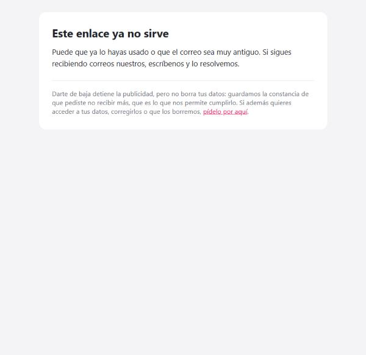
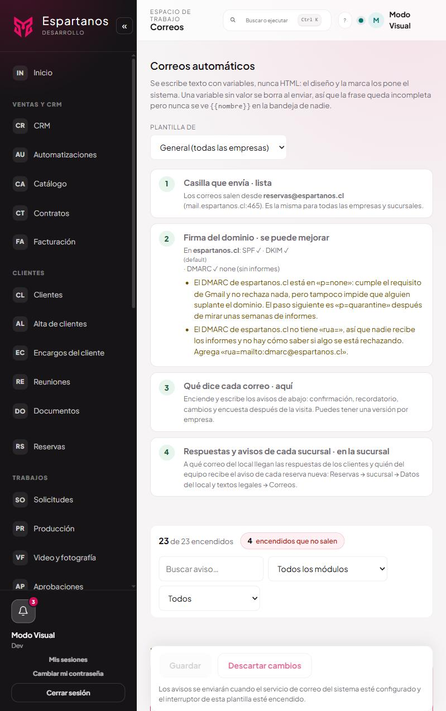

# El camino de salida

Cómo se da de baja alguien, qué pasa después, y qué guarda el sistema para poder cumplirlo.
**No se configura: funciona solo en todo correo comercial.**

Es la parte del sistema que más decide si tus correos llegan. Quien no encuentra cómo salirse marca
el mensaje como spam, y eso no le hace daño a esa campaña: se lo hace a **todos** los correos de
**todos** los locales a la vez, durante meses.

---

## 1 · El camino completo

```
Correo comercial
│
├─ Pie del mensaje: «Dejar de recibir estos correos»
└─ Botón de Gmail/Yahoo junto al remitente: «Anular suscripción»
        │
        ▼
   GET  → Página de confirmación      ← el enlace NO da de baja al abrirlo
        │
        ▼
   POST → Se ejecuta la baja
        │
        ├─ alcance «local» → sólo esa empresa
        └─ alcance «todas» → todas sus fichas + huella en la lista de exclusión
        │
        ▼
   Página «Listo»
   └─ al pie: «¿también quieres que borremos tus datos?» → /solicitudes
```

---

## 2 · Lo que ve quien hace clic


| Elemento | Por qué está así |
|---|---|
| **El correo a medias** (`an•••••@correo.cl`) | La página es pública y puede quedar abierta a la vista de otro en un mesón o en una pantalla compartida |
| **«Sí, dar de baja»** | Botón grande: es lo que la mayoría viene a hacer |
| **«Darme de baja de todos los locales»** | Enlace, no botón, pero **a la vista desde el primer momento** |
| **La nota del final** | Que las confirmaciones de reserva siguen llegando. No son publicidad |

Y después:


La salida completa sigue a mano, y el canal de derechos al pie. Si ya se dio de baja de todos, ese
botón desaparece: no tiene sentido ofrecer lo mismo dos veces.

Si el enlace ya no sirve:



No dice si esa dirección está o no en el sistema. Un enlace que respondiera distinto según eso
serviría para averiguarlo probando.

---

## 3 · Por qué el enlace pregunta antes

Abrir el enlace **no da de baja a nadie**. Muestra una página con un botón, y la baja ocurre al
apretarlo.

Parece un paso de más. No lo es: **Outlook y los antivirus de correo abren los enlaces de un
mensaje para revisarlos antes de dejártelo ver.** Con la baja colgada de la simple apertura del
enlace, esos escáneres daban de baja a personas que nunca hicieron clic.

Y eso no se arregla después. El artículo 28 B dice que, pedida la suspensión, los envíos siguientes
*«quedarán desde entonces prohibidos»*: el sistema no puede volver a suscribir a alguien por su
cuenta, ni aunque sepa que fue un error. **Una baja equivocada es definitiva.**

El botón resuelve el problema sin poner ningún obstáculo real: sigue siendo un clic desde el correo,
sin contraseña y sin formulario.

---

## 4 · Los dos alcances

| Botón | Qué hace | Qué queda anotado |
|---|---|---|
| **Sí, dar de baja** | Sale de la lista de **ese local** | Baja en esa ficha + huella para esa empresa |
| **Darme de baja de todos** | Sale de **todas** las listas de la organización | Baja en todas sus fichas + huella **sin empresa** |

Los dos aparecen desde el primer momento, no escondiendo el segundo detrás del primero.

El motivo **práctico**: quien está molesto y no encuentra cómo salirse del todo usa «marcar como
spam». Ofrecer la salida completa en el mismo sitio convierte una queja formal ante Gmail en una
baja limpia.

El motivo **legal**: la baja por local corresponde a cómo están repartidos los permisos —cada local
es responsable distinto y el permiso se le dio a cada uno por separado—. Pero alguien puede querer
salirse de todo de una vez, y eso tiene que poder hacerse en un clic.

**Una baja ya anotada no se pisa.** Si alguien que ya estaba de baja de un local pulsa «de todos»,
las fichas que ya tenían su fecha la conservan: esa fecha es la que vale si reclama por los envíos.

---

## 5 · Qué se guarda, y qué no

**En su ficha:** la fecha, el alcance y **desde qué correo** pidió la baja. Del alta se guardaba
todo —origen, texto aceptado, fecha, IP— y de la baja sólo la fecha; si alguien reclama que siguió
recibiendo, hay que poder demostrar qué pidió y cuándo.

**En la lista de exclusión:** una **huella** de su correo. No el correo: un código irreversible
calculado a partir de él, que sirve para una sola cosa —responder «¿a esta dirección le prohibí
escribir?» cuando ya se tiene la dirección por otra vía— y que no se puede listar ni revertir.

Esa huella es lo que hace que la prohibición **sobreviva al borrado de los datos**. Si alguien pide
que le borren todo, se borra todo **menos** el hecho de que pidió no recibir más: sin eso, la
siguiente reserva volvería a meterlo en la lista y se incumpliría el artículo 28 B.

---

## 6 · Qué NO hace darse de baja

Lo dice la propia página, al pie:

> Darte de baja detiene la publicidad, pero no borra tus datos: guardamos la constancia de que
> pediste no recibir más, que es lo que nos permite cumplirlo. Si además quieres acceder a tus
> datos, corregirlos o que los borremos, pídelo por aquí.

Son dos puertas y conviene que se vean distintas. La baja detiene el correo comercial; el borrado se
pide en **/solicitudes** y tiene su procedimiento y sus plazos ([manual 08](08-solicitudes-de-derechos.md)).

**Lo que sigue llegando después de una baja:** la confirmación de una reserva que haga, su
recordatorio, el enlace para gestionarla. No son publicidad: son parte del servicio que pidió.

---

## 7 · Qué correos llevan enlace de baja, y cuáles no

**Los tres que sí lo llevan**, porque son publicidad:

| Correo | Clave |
|---|---|
| Campaña escrita a mano | `email.campaign` |
| Saludo de cumpleaños | `email.birthday` |
| Cupón después de la visita | `email.coupon` |

**Todos los demás no lo llevan**, y cada uno por su motivo:

| Correo | Clave | Por qué no |
|---|---|---|
| Confirmación de reserva | `email.reservation_confirmation` | Es el servicio que pidió |
| Recordatorio de reserva | `email.reservation_reminder` | Ídem |
| Enlace para gestionar la reserva | `email.manage_link` | Lo pidió esa persona |
| El cliente canceló o cambió · acuse | `email.*_ack` | Responde a algo que hizo |
| Cupo liberado en lista de espera | `email.waitlist_spot` | Lo pidió al anotarse |
| **Invitación a una encuesta** | `email.survey_invite` | Es una pregunta sobre un servicio ya prestado, no una oferta |
| **Encuesta después de la visita** | `email.post_visit_survey` | Ídem |
| **Mensaje de una encuesta al equipo** | `email.team_survey_message` | Alerta de trabajo. Con baja, alguien podría apagarse los avisos de nota baja de su local |
| Reserva nueva, grupo, lista de espera | `email.team_*` | Avisos de trabajo |
| **Reservas pausadas o día cerrado** | `email.team_operation` | Ídem |
| Campaña a quienes administran una empresa | `email.campaign` con destino administradores | Información del servicio contratado, no promoción |
| Resumen diario, tareas, cobranza | `email.daily_digest`, `email.task_reminder`, `email.collection_overdue` | Internos o contractuales |
| Clave temporal, recuperar acceso | `email.access_*` | Son de la plataforma: sin ellos nadie entra |

**Las encuestas son el caso que más se discute**, y por eso están en negrita. Una encuesta no
vende nada: pregunta por algo que ya pasó. Y la misma plantilla sirve para las encuestas al
equipo, donde un enlace de baja dejaría que un trabajador se quitara de las comunicaciones de su
propio trabajo.

Poner el enlace donde no corresponde no es «ir sobre seguro»: crea la expectativa de poder darse de
baja de algo que es parte del servicio o del trabajo.

---

## 8 · El botón de Gmail y Yahoo

Además del enlace del pie, el correo comercial lleva **dos cabeceras**:

| Cabecera | Qué dice |
|---|---|
| `List-Unsubscribe` | Dónde está la baja |
| `List-Unsubscribe-Post: List-Unsubscribe=One-Click` | Que se puede hacer **sin preguntar** |

Con la primera sola **el botón no aparece**: la cabecera dice dónde, pero sin la segunda no hay
permiso para hacerlo sin preguntar, así que el cliente de correo la ignora y la persona acaba
usando «marcar como spam».

**Que las cabeceras estén no garantiza que el botón aparezca.** Gmail y Yahoo deciden mirando
además:

| Factor | Qué significa |
|---|---|
| **Reputación del dominio** | El umbral de Gmail es **menos del 0,3%** de reportes de spam. Por encima degradan todo, no sólo el botón |
| **Autenticación** | SPF, DKIM y **DMARC** alineados. Sin DMARC publicado, un remitente de volumen está en la categoría con menos privilegios |
| **Volumen y constancia** | A un remitente nuevo o esporádico lo tratan con desconfianza hasta que acumula historial |
| **Que la baja funcione** | Si el botón falla al usarlo, dejan de confiar en la cabecera |

Puede tardar días o semanas en aparecer y no significa que esté mal puesto.

### Cómo está hoy el dominio, y qué falta


*El paso 2 de **Correos**, con cuenta Dev. Consulta el DNS cada vez que se abre la pantalla y dice
qué hay publicado y qué falta.*

**Esto antes no se veía en ninguna parte.** Es la única pieza del envío que no vive en el código:
se edita en el panel DNS del hosting, no se despliega, y si alguien la borra no aparece ningún
error — los correos simplemente empiezan a caer en spam. Ahora la plataforma lo consulta sola.

Qué comprueba y qué no:

- **Comprueba que los registros existan y qué dicen.** Es una consulta DNS, no un envío de prueba:
  verifica que la clave DKIM esté publicada, no que la firma de cada mensaje valide.
- **No mide la reputación.** Un dominio con los tres registros perfectos puede estar en spam por
  quejas de los destinatarios; eso se mira en Google Postmaster Tools.
- **Distingue «falta» de «no se pudo consultar».** Si el DNS no responde lo dice así, en vez de
  decir que falta un registro: con lo contrario, alguien acabaría reemplazando un SPF correcto.
- **`p=none` sale como aviso, no como error.** Es deliberado: con `p=none` el correo **sí llega** y
  se cumple el requisito de Gmail. Pintarlo en rojo junto a un DKIM ausente haría que se ignoraran
  los dos.

Las tres firmas que miran Gmail y Yahoo, consultadas en el DNS de `espartanos.cl`:

| Firma | Qué dice hoy | Estado |
|---|---|---|
| **SPF** | `v=spf1 ip4:190.3.170.42 a include:_spf.ihosting.cl mx -all` | **Bien.** Termina en `-all`, que es la forma estricta: lo que no esté en la lista se rechaza |
| **DKIM** | Selector `default`, clave RSA publicada | **Bien** |
| **DMARC** | `v=DMARC1; p=none;` | **Insuficiente.** Sólo observa, y sin `rua=` nadie recibe los informes |

`p=none` cumple el mínimo que exige Gmail —que exista un DMARC—, pero no protege: cualquiera
puede mandar correo diciendo ser tu dominio y nada lo detiene.

**Cómo arreglarlo, en dos pasos y no de golpe.** Es un registro TXT en `_dmarc.espartanos.cl`, en
el panel DNS del proveedor.

Primero, sin cambiar la política, para empezar a ver quién manda en tu nombre:

```
v=DMARC1; p=none; rua=mailto:dmarc@espartanos.cl; fo=1
```

Dos o tres semanas después, con los informes limpios:

```
v=DMARC1; p=quarantine; pct=100; rua=mailto:dmarc@espartanos.cl; fo=1; adkim=r; aspf=r
```

Saltarse el primer paso es lo que rompe el correo: si algo legítimo —una herramienta de
facturación, un boletín— está mandando sin firmar, con `quarantine` empieza a caer en spam el
mismo día, y te enteras por los reclamos.

---

## 9 · Dónde queda cada cosa

| Qué | Dónde |
|---|---|
| El estado de la ficha | `email_subscribers`: `status`, `unsubscribed_at`, `unsubscribed_scope`, `unsubscribed_from` |
| La prohibición | `email_suppression`: huella SHA-256 de `organización:correo`, empresa, alcance, origen |
| El token del enlace | `unsubscribe_token`, aleatorio y no derivado del correo |

El token **es aleatorio a propósito**: derivado del correo, cualquiera podría dar de baja a otra
persona calculándolo.

| Acción | Endpoint |
|---|---|
| Preguntar (abrir el enlace) | `GET /marketing/suscriptores/baja/:token` |
| Ejecutar la baja | `POST /marketing/suscriptores/baja/:token` |

Las dos son **públicas y sin sesión**, con un límite de 20 por minuto: el token viaja en un correo y
acaba en sitios donde lo ven terceros, así que sin límite alguien podría probar tokens al azar.

El `POST` acepta el alcance de tres formas, porque llega por tres caminos: el formulario de la
página, la cabecera de Gmail —que manda su propio campo y nada más— y los enlaces antiguos que lo
traen en la dirección.

---

## 10 · A qué ley responde

**Ley 19.496, art. 28 B.** Es la norma central. Exige que todo mensaje promocional indique quién lo
manda y contenga *«una dirección válida a la que el destinatario pueda solicitar la suspensión de
los envíos»*, y que una vez solicitada *«quedarán desde entonces prohibidos»*. De ahí salen tres
cosas: el enlace en cada correo, que funcione sin cuenta, y que la prohibición no caduque.

**Ley 21.719, revocación.** Retirar el consentimiento tiene que ser tan fácil como darlo. Si darlo
fue marcar una casilla al reservar, retirarlo no puede exigir iniciar sesión ni rellenar un
formulario.

**Ley 21.719, supresión, y cómo convive con lo anterior.** Las dos obligaciones parecen chocar: una
dice «recuerda que te pidió no escribirle», la otra «bórralo si te lo pide». Se concilian porque lo
que se conserva es una huella irreversible y no la dirección: el mínimo necesario para cumplir un
deber legal, que es la excepción que hace que la supresión no lo alcance.

**Reglas de Gmail y Yahoo (febrero 2024).** No son ley, pero deciden si tu correo llega.

---

## 11 · Preguntas que van a salir

**Alguien dice que se dio de baja y sigue recibiendo. ¿Cómo lo compruebo?**
Marketing → Suscriptores → al pie, **«Pidieron no recibir más»**. Escribe su correo y consulta
([manual 06](06-suscriptores-y-exclusiones.md)).

**Me llegó un aviso del SERNAC. ¿Qué hago?**
Misma pantalla, **«Anotar una petición recibida por fuera»**, y hazlo de inmediato: el reglamento
del Sistema No Molestar (Decreto 62 de 2019, art. 5) prohíbe el envío **desde el momento en que la
persona registró la solicitud**, no desde que nos llegó el aviso. No hay plazo de gracia. Anota
además la **fecha que trae el aviso**, no la de hoy ([manual 06](06-suscriptores-y-exclusiones.md)).

**¿Puedo volver a suscribir a alguien que se dio de baja?**
Sólo si esa persona lo pide expresamente y sabiendo que había pedido no recibir. Reservar de nuevo
no basta.

**¿Y si alguien se da de baja por error?**
No se revierte solo, ni siquiera sabiendo que fue un error: la ley no lo admite. Tiene que volver a
darlo expresamente. Por eso el enlace pregunta antes.

**¿Cuánto se guarda la huella?**
Indefinidamente mientras exista la lista, y no es comodidad: el artículo 28 B dice que tras la
petición los envíos «quedarán desde entonces prohibidos», sin caducidad. Borrarla es volver a
escribirle. Se concilia con el derecho de supresión porque lo guardado es un código irreversible y
no la dirección: el mínimo necesario para cumplir un deber legal.

**¿Y el resto de los registros?**
Cinco años desde la baja o desde la respuesta. Sale de tres plazos que se superponen y manda el más
largo: la prescripción infraccional de la Ley 19.496 es de **seis meses** pero **se suspende**
mientras dure un procedimiento ante el SERNAC; tras responder una solicitud de derechos el titular
tiene **30 días hábiles** para reclamar ante la Agencia; y la prescripción civil ordinaria es de
**cinco años**.
