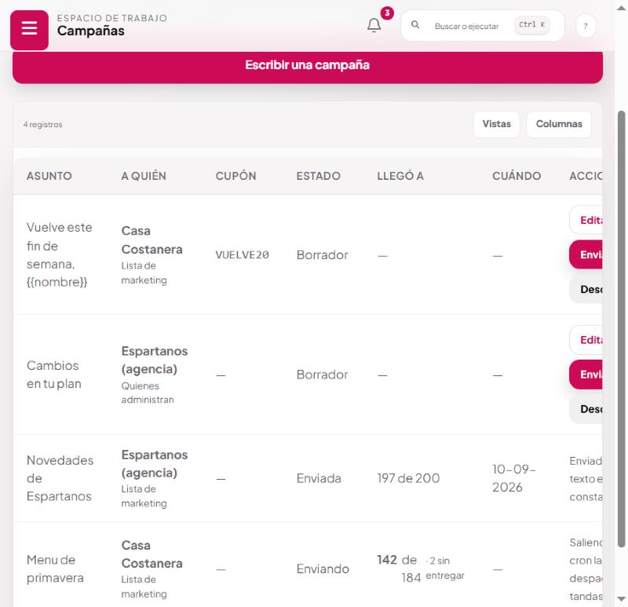
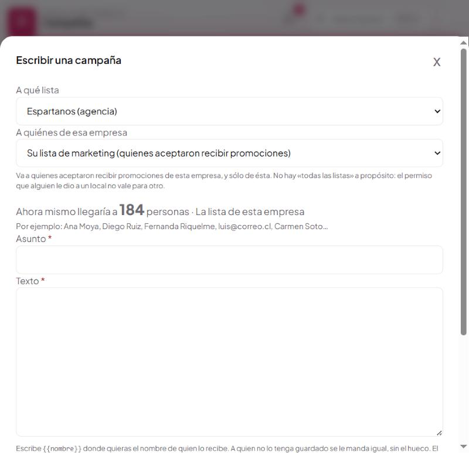
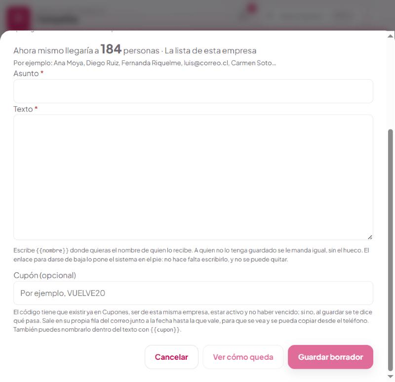
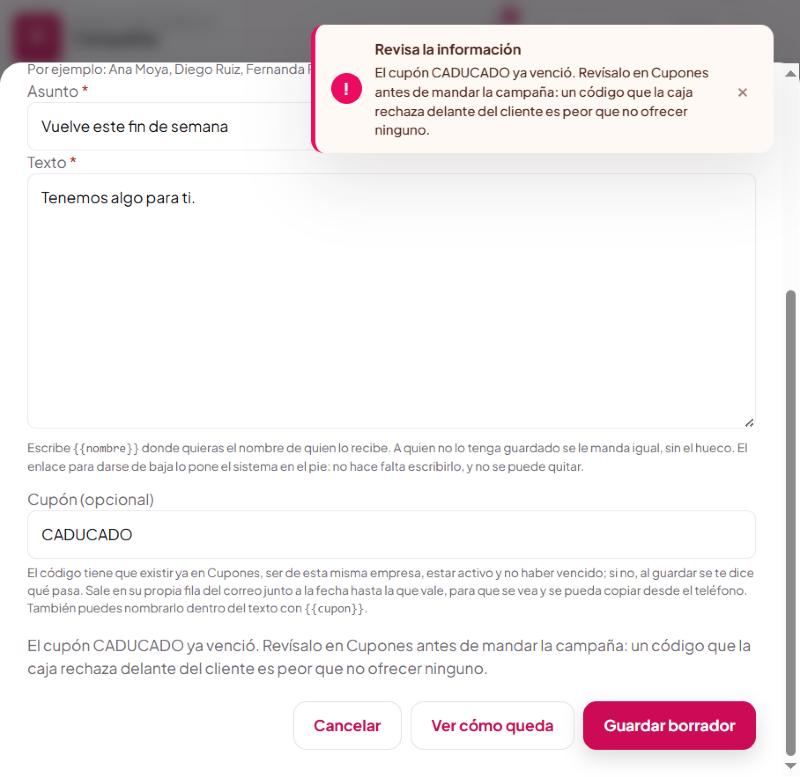
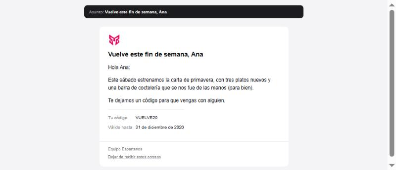
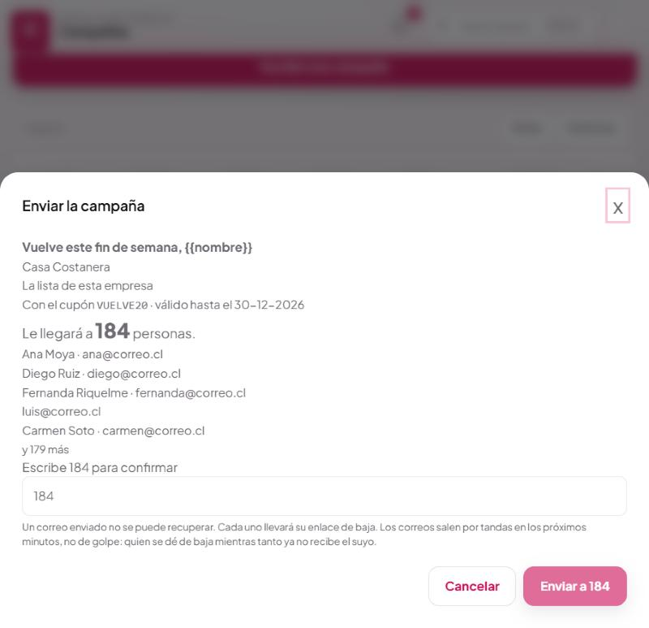

# Campañas

Escribir un correo y mandárselo a una lista. **Marketing → Campañas.**

Es la única comunicación del sistema que nadie pidió individualmente: el resto —confirmación de
reserva, clave temporal, saludo de cumpleaños— responde a algo que esa persona hizo. Por eso es la
que más rejas lleva, y la única que **no se puede deshacer**.

---

## 1 · La pantalla



| Columna | Qué dice |
|---|---|
| **Asunto** | Con las variables sin reemplazar, tal como se escribió |
| **A quién** | Dos líneas: la empresa, y debajo si fue a su lista o a quienes la administran |
| **Cupón** | El código, si lleva |
| **Estado** | Borrador · Enviando · Enviada |
| **Llegó a** | `197 de 200` cuando terminó; el avance en vivo mientras sale |
| **Cuándo** | La fecha del envío |

La columna **A quién** va en dos líneas a propósito: la empresa sola no dice si el correo fue a sus
clientes o a quienes la administran, que son dos correos muy distintos.

### Los tres estados, y qué se puede hacer en cada uno

| Estado | Editar | Enviar | Descartar | Por qué |
|---|:--:|:--:|:--:|---|
| **Borrador** | ✓ | ✓ | ✓ | Todavía no salió nada |
| **Enviando** | ✗ | ✗ | ✗ | El cron la está despachando por tandas |
| **Enviada** | ✗ | ✗ | ✗ | Su texto es la constancia de lo que salió |

Una campaña **sólo avanza**. De «Enviada» no se vuelve.

---

## 2 · Escribir una campaña

Pulsa **Escribir una campaña**.

### Paso 1 · A qué lista



Se elige al crear y **no se puede cambiar después**. Mover una campaña de empresa mandaría a una
lista un texto escrito para otra, y el permiso de cada lista se dio por separado.

Si editas una campaña ya guardada, el selector no aparece: en su lugar dice *«La lista no se cambia
después de escrita: el texto está pensado para ésa»*.

### Paso 2 · A quiénes de esa empresa

| Destino | Quiénes son | ¿Exige permiso de marketing? | ¿Lleva enlace de baja? |
|---|---|:--:|:--:|
| **Su lista de marketing** | Quienes aceptaron recibir promociones de esa empresa | **Sí** | **Sí** |
| **Quienes administran la empresa** | Las cuentas **activas** de esa empresa en el sistema | No | **No** |

El segundo es un aviso de servicio a quien contrató —un cambio en su plan, una funcionalidad
nueva—, no publicidad. Por eso no exige permiso de marketing y no lleva enlace de baja: nadie se da
de baja de que le cuenten cómo va el servicio que paga.

**Si lo que vas a mandar es publicidad, éste no es el destino.** La pantalla te lo dice al elegirlo
y otra vez al confirmar el envío.

Sólo cuentas **activas**: escribirle a quien ya no trabaja ahí es filtrarle a un tercero lo que pasa
en esa empresa.

### Paso 3 · Asunto y texto

Escribe `{{nombre}}` donde quieras el nombre de quien lo recibe. A quien no lo tenga guardado se le
manda igual y **sin el hueco**: «Hola ,» delata que no sabías a quién le escribías.

| Variable | Qué pone |
|---|---|
| `{{nombre}}` | El nombre de la ficha, o nada |
| `{{cupon}}` | El código, si la campaña lleva uno |

El enlace de baja lo pone el sistema en el pie. No hace falta escribirlo y **no se puede quitar**.

### Paso 4 · Cupón (opcional)



Escribe el código de un cupón que **ya exista** en Cupones. Al guardar se comprueban cuatro cosas,
en este orden, y el mensaje dice cuál falló:

| Comprobación | Si falla, el mensaje dice |
|---|---|
| Que exista | «El cupón X **no existe**…» |
| Que sea de esta misma empresa | «…**es de otra empresa**…» |
| Que esté activo | «…**está desactivado**…» |
| Que no haya vencido | «…**ya venció**…» |



Se comprueba **al guardar y no al enviar** para que te enteres mientras todavía puedes corregirlo.
Un código que la caja rechaza delante del cliente es peor que no ofrecer ninguno.

### Paso 5 · Ver cómo queda

Lo compone el servidor con la misma función que el envío, así que **lo que ves es lo que sale**, con
el pie de baja incluido. El nombre va con un dato de ejemplo y el enlace del pie es de muestra.

---

## 3 · El correo que llega



De arriba abajo:

1. **El asunto**, con las variables ya reemplazadas.
2. **El logo** de la casa.
3. **El texto** que escribiste, respetando los saltos de línea.
4. **El cupón en su propia fila**, con la fecha hasta la que vale. Escrito dentro del texto se
   pierde entre las frases y quien lo lee en el teléfono tiene que buscarlo para copiarlo; en su
   fila se ve de una y se puede seleccionar.
5. **El pie**: la firma y el enlace de baja, como enlace discreto y no como botón. Es un correo
   para que la persona lea una oferta, no para que se dé de baja: el enlace tiene que estar, no
   competir con el motivo del correo.

El mismo mensaje sale además **en texto plano**, sin HTML. No es un detalle estético: mandar sólo
HTML es de las causas más comunes de caer en spam o en la pestaña «Promociones».

---

## 4 · Antes de apretar el botón

Mientras escribes, la pantalla dice en vivo a cuántos llegaría, de qué lista son, y unos nombres:

> Ahora mismo llegaría a **184 personas** · La lista de esta empresa
> Por ejemplo: Ana Moya, Diego Ruiz, Fernanda Riquelme, luis@correo.cl, Carmen Soto…

Y al enviar, otra vez, con todo junto:



**Hay que escribir el número a mano para confirmar.** Es deliberadamente incómodo: un envío no se
deshace, y escribir la cifra obliga a mirarla en vez de confirmar por reflejo. Si el número cambió
entre que abriste la pantalla y el envío, lo que escribes ya no cuadra y tienes que volver a mirar.

«312 personas» no dice si son las que crees. La muestra va corta a propósito: sirve para
**reconocer** la lista, no para leerla —eso está en Suscriptores, con sus filtros—.

Si la lista está vacía, el botón no se habilita y la pantalla explica por qué: *«No hay nadie
suscrito en esta lista ahora mismo. Los que están en «pendiente» o se dieron de baja no cuentan»*.

---

## 5 · Qué pasa después de enviar

El botón **encola; no manda**.

```
Aprietas «Enviar a 184»
   ↓
La campaña pasa a «Enviando»  ← con una condición sobre el estado anterior:
   ↓                             si otra petición ganó la carrera, aquí no se encola nada
Se insertan las 184 filas de una vez
   ↓
El cron «campañas» despacha por tandas, cada 5 minutos
   ↓         │
   │         └── antes de cada correo comprueba otra vez:
   │             ¿sigue suscrita? ¿sigue sin estar en la lista de exclusión?
   ↓
Cuando no queda ninguna pendiente, la campaña pasa a «Enviada»
```

**Por qué no manda en el momento.** Doscientos correos no caben en una petición: el `curl` del cron
corta al minuto y el servidor antes. La lista se enviaba a medias y la campaña quedaba en «enviando»
para siempre, sin forma de reanudarla ni de repetirla —la misma guarda que impide el doble envío
impedía arreglarlo—.

Encolar gana tres cosas: un rebote reintenta a **esa persona** y no a la campaña, una ejecución que
muere a medias la recoge la siguiente pasada, y queda constancia de a quién le llegó.

**Una baja entre el encolado y el envío se respeta.** Entre que aprietas el botón y sale el último
correo pasan minutos, y en ese rato alguien puede darse de baja desde un correo anterior. El
artículo 28 B no da margen, así que la comprobación va pegada al envío y no a la intención.

### Lo que no se pudo entregar

Tres intentos, y sólo si el fallo suena a problema del momento —tiempo agotado, conexión cortada,
el servidor de correo no aceptó—. Un rebote permanente —dirección que no existe, dominio que no
resuelve— da el mismo resultado las tres veces, y gastar los intentos sólo retrasa la constancia de
que no llegó.

Las demás bandejas reintentan ocho veces; ésta tres, porque al otro lado hay una persona y el
octavo intento llegaría dos días después de que la campaña dejó de tener sentido.

---

## 6 · Dos cosas que esta pantalla no tiene, a propósito

**No hay caja para escribir direcciones a mano.** Una dirección sin procedencia no se puede
defender ante «¿de dónde sacaron mi correo?», que es la primera pregunta de cualquier reclamo. Para
eso está **Importar**, que exige declarar de dónde salió y deja constancia; una vez importadas, la
campaña las alcanza como a cualquier otra.

**No hay «todas las listas».** Quien aceptó promociones de Casa Costanera se las dio **a Casa
Costanera**, no a Espartanos ni a Bar Ruperto. Mandarle a todas de una vez usaría un permiso dado
para una cosa en otra.

Para hablarle a quien sí quiere saber de toda la red está la **lista de la agencia**, que tiene el
permiso correcto y se llena sola con la casilla de la red ([manual 01](01-beneficios-de-la-red.md)).
Se elige como cualquier otra empresa.

---

## 7 · Quién puede qué

| Cargo | Escribir | Enviar |
|---|:--:|:--:|
| Administración, Dirección Comercial, Dev | ✓ | ✓ (exige nivel `manage`) |
| **La cuenta de la empresa** | ✗ | ✗ |

Enviar exige un permiso mayor que escribir: mandar un correo a una lista entera no se deshace, y no
es lo mismo que redactar el borrador. Quien puede redactar no manda por eso.

Una cuenta de empresa mira su lista y **se la descarga** para escribir por su cuenta; enviar desde
aquí no. No es desconfianza: quien aprieta el botón responde de que cada dirección de esa lista
tenga respaldo, y ese respaldo lo lleva la agencia.

---

## 8 · Dónde queda cada cosa

| Qué | Dónde |
|---|---|
| La campaña | Tabla `email_campaigns`: asunto, cuerpo, cupón, destino, estado, recuento, quién la creó |
| Cada destinatario | Tabla `email_campaign_sends`: a quién, en qué estado, cuántos intentos, el último error |
| El envío de cada correo | Registro de correos (Dev) |
| Quién la mandó | `created_by` en la campaña |

El recuento **se fija al enviar y no se recalcula**: la lista cambia, y la pregunta que hay que
responder es a cuántos les llegó **ese día**.

| Acción | Endpoint |
|---|---|
| Listar | `GET /marketing/campanas` |
| A cuántos llegaría | `GET /marketing/campanas/destinatarios?empresa=…&destino=…` |
| Vista previa | `POST /marketing/campanas/vista-previa` |
| Crear / corregir / descartar | `POST`, `PATCH /:id`, `DELETE /:id` |
| Encolar el envío | `POST /marketing/campanas/:id/enviar` |
| Avance | `GET /marketing/campanas/:id/avance` |

**Cron:** el despacho corre con el resto de las bandejas de salida. Sin ese cron, una campaña
encolada **se queda encolada**: el botón no manda nada por sí solo.

---

## 9 · A qué ley responde

**Ley 19.496, art. 28 B.** Cada correo lleva identificación del remitente y enlace de suspensión, y
el enlace no se puede desactivar. La comprobación pegada al envío es lo que cumple el *«quedarán
desde entonces prohibidos»* incluso para una baja ocurrida dos minutos antes de que saliera.

**Ley 21.719, finalidad.** Los datos sólo pueden tratarse para fines *determinados, explícitos y
legítimos*. De ahí sale que no se pueda cambiar la lista de una campaña ya escrita, y que no exista
«todas las listas».

**Ley 21.719, responsabilidad proactiva.** La campaña enviada no se borra ni se edita: ante un
reclamo hay que poder decir qué texto salió, a qué lista, quién lo mandó y cuándo.

**Por qué el destino «administradores» no lleva baja.** Porque no es comunicación promocional sino
información del servicio contratado, prestada en el marco de una relación contractual. El art. 28 B
habla de comunicaciones *promocionales o publicitarias*. Si alguna vez se usa para venderles algo,
deja de ser esto y necesita su propio respaldo.

---

## 10 · Preguntas que van a salir

**¿Puedo repetir una campaña ya enviada?**
No se reenvía la misma. Duplica el texto en una nueva: así queda constancia de que fueron dos
envíos distintos, que es lo que realmente ocurrió.

**¿Por qué no puedo borrar una campaña enviada?**
Porque su texto es la constancia de lo que salió. Los borradores sí se descartan.

**Puse un cupón y me dice que es de otra empresa.**
Los cupones son por empresa. Crea uno para ésta en Cupones, o elige el de esta empresa.

**«No hay nadie suscrito en esta lista ahora mismo».**
Los que están en «pendiente» —importados sin declarar qué aceptaron— y los que se dieron de baja no
cuentan. Mira la lista en Suscriptores filtrando por estado.

**La campaña lleva media hora en «Enviando».**
Normal si la lista es larga: el cron despacha por tandas cada cinco minutos. Si no avanza nada en
una hora, el cron no está corriendo.

**¿Cuántos correos puedo mandar de una vez?**
No hay tope en la pantalla. El tope real es la reputación del dominio: ver el apartado del botón de
Gmail en [el manual 04](04-darse-de-baja.md).
