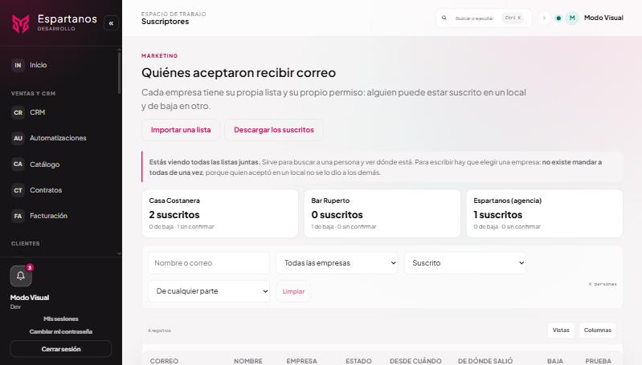
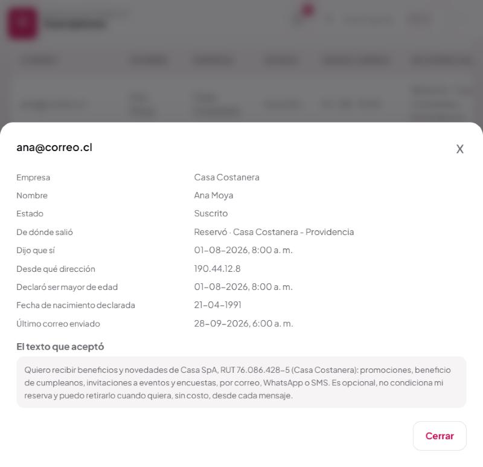
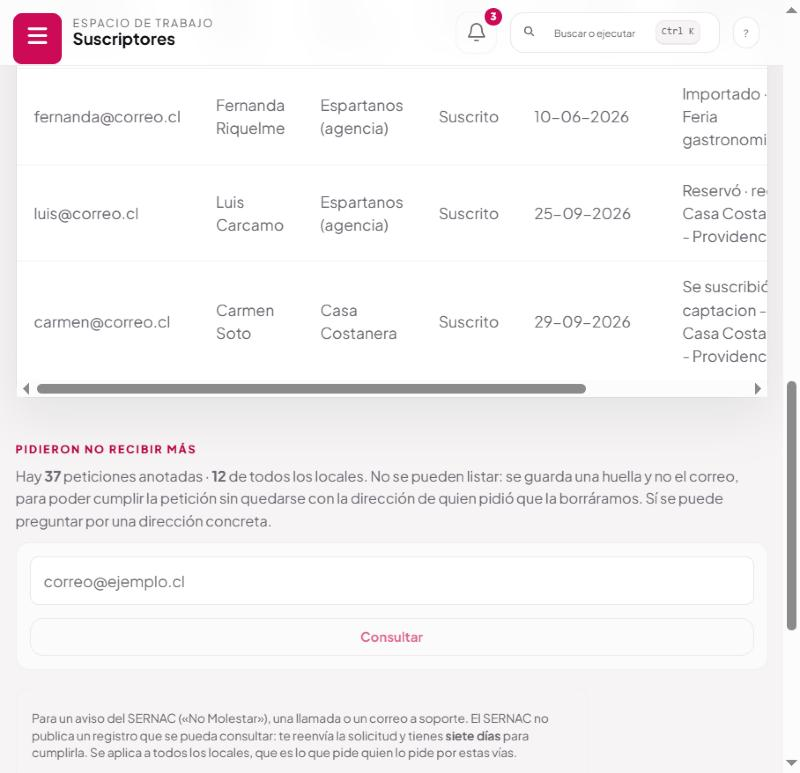
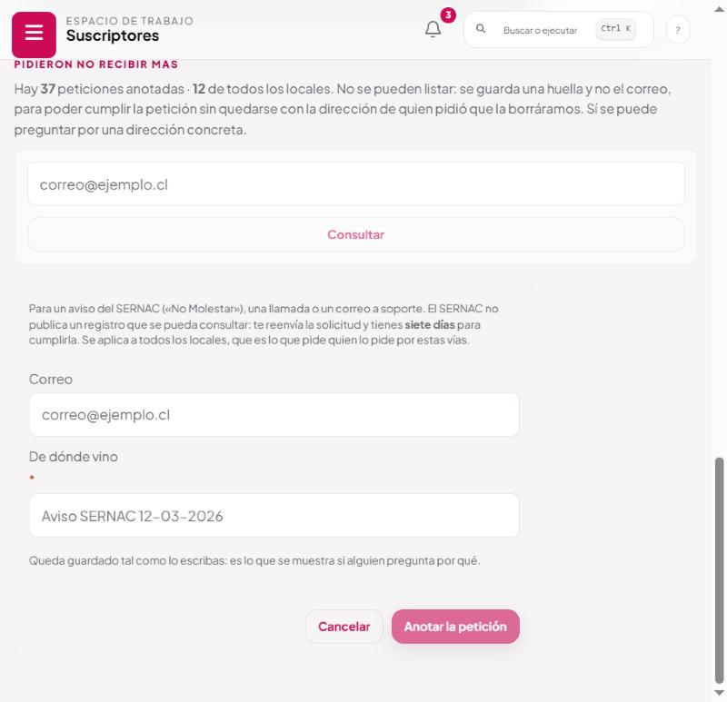

# Suscriptores y exclusiones

La lista, la prueba de cada dirección, y quién pidió no recibir más. **Marketing → Suscriptores.**

Esta pantalla contesta dos preguntas distintas. Arriba, «¿quién está en la lista?». Abajo, «¿a quién
tengo prohibido escribirle?». La segunda no es una lista que se pueda mirar, y eso tiene una razón.

---

## 1 · Arriba: quiénes están

*La línea de arriba cambia con el filtro: dice qué lista estás viendo y qué se puede hacer con ella.*

Cada empresa tiene su propia lista y su propio permiso. **La misma persona puede estar suscrita en
un local y de baja en otro** —mira a Ana Moya en la captura—, y eso no es un error: son permisos
distintos dados a responsables distintos.

Las tarjetas de arriba resumen cada empresa y **filtran al tocarlas**.

### Los filtros

| Filtro | Qué hace |
|---|---|
| Buscar | Por nombre **o** correo, con la misma caja: se busca a una persona, no un campo |
| Empresa | Todas, la agencia, o una concreta. **No aparece** para una cuenta de empresa |
| Estado | Suscrito / Pendiente / De baja. De fábrica muestra **Suscrito** |
| Procedencia | Sólo las que existen de verdad, para no ofrecer lo que no hay |

### Los tres estados

| Estado | Qué significa | ¿Se le puede escribir? |
|---|---|---|
| **Suscrito** | Dijo que sí, y consta cuándo y ante qué texto | Sí |
| **Pendiente** | Está en la lista pero nadie le ha preguntado | **No** |
| **De baja** | Se dio de baja o dijo que no | **No, nunca más** |

Tres y no dos porque «todavía no ha dicho que sí» y «dijo que no» son cosas distintas: a la primera
se le puede preguntar una vez, a la segunda no se le puede escribir nunca más.

«Pendiente» es, casi siempre, una fila importada sin declarar qué aceptó.

### Dos cosas más que deciden si recibe

Aunque esté «Suscrito», no recibe campañas si:

- **Declaró ser menor de edad**, o su fecha de nacimiento dice que lo es. La declaración manda sobre
  la fecha: es lo que la persona afirmó expresamente. Si no hay ninguna de las dos, se permite —
  exigirlas dejaría fuera a toda la lista recogida antes de preguntarlas—.
- **Está en la lista de exclusión**, aunque su ficha diga «Suscrito». Se comprueba pegado al envío.

### De dónde salió cada una

| Procedencia | Qué fue |
|---|---|
| **Reservó** | Marcó la casilla de beneficios al reservar |
| **Reservó · red** | Marcó la casilla de los demás locales. Entra a la lista de la agencia |
| **Se suscribió** | Entró por el QR o el enlace del local, sin reservar |
| **Importado** | Vino de un archivo, con su origen declarado |

---

## 2 · Ver ficha: la prueba de una dirección

| Dato | Para qué sirve |
|---|---|
| Empresa, nombre, estado | Lo evidente |
| **De dónde salió** | La respuesta a «¿de dónde sacaron mi correo?» |
| **Dijo que sí** | Fecha y hora exactas |
| **Desde qué dirección** | La IP. Convierte «dijo que sí» en comprobable. Vacía en las importaciones, donde el respaldo es el archivo |
| Declaró ser mayor de edad | Fecha, o «no consta» |
| Fecha de nacimiento declarada | Para el beneficio de cumpleaños |
| Último correo enviado | Para no repetir campañas sobre la misma gente |
| **Se dio de baja** | Fecha, alcance, y **desde qué correo** la pidió |
| **El texto que aceptó** | Entero, tal como lo leyó |

El texto va entero y sin resumir. Se guardaba desde siempre y **no se mostraba en ninguna parte**:
guardar la prueba sin poder leerla no sirve para el día en que alguien reclame.

Si dice *«No consta ningún texto»*, esa dirección vino de una importación sin declarar qué aceptó.
No se puede defender, y por eso queda en «pendiente» y no recibe campañas.

---

## 3 · Abajo: quiénes pidieron no recibir más

### Por qué no se pueden listar

Porque lo que se guarda no es el correo sino una **huella** suya: un código irreversible del que no
se puede volver a la dirección.

Esto resuelve una contradicción real entre dos obligaciones:

| Obligación | Qué exige |
|---|---|
| Art. 28 B, Ley 19.496 | **Recordar** que pidió no recibir. Si lo olvidas, le vuelves a escribir |
| Derecho de supresión, Ley 21.719 | **Borrar** sus datos si te lo pide |

Guardando una huella se cumplen las dos: alcanza para no volver a escribirle y no conserva el dato
de quien pidió que lo borraran.

El precio es que **sólo se puede preguntar, no mirar**. Y preguntar es justo lo que hace falta
cuando alguien llama diciendo «sigo recibiendo correos».

### Consultar una dirección

Escribe el correo y pulsa **Consultar**. Tres respuestas:

| Respuesta | Qué hacer |
|---|---|
| **«Pidió no recibir de ningún local»** | Si dice que sigue recibiendo, mira qué correo recibió: una confirmación de reserva **no** es publicidad |
| **«Pidió no recibir de una empresa»** | Dice de cuál, desde cuándo y desde qué correo. Si le llegó algo de ésa después de esa fecha, hay un problema real |
| **«No consta ninguna petición»** | Búscala arriba en la lista: puede estar suscrita y no haber pedido la baja nunca |

---

## 4 · Anotar una petición recibida por fuera

No toda petición de baja llega por el enlace del correo. Llega por tres caminos más, y los tres
obligan igual:

### El SERNAC: cómo funciona de verdad

**No es un registro que uno consulte.** Funciona al revés:

1. El consumidor entra al Portal del Consumidor, escribe su correo y **elige las empresas** que
   quiere bloquear. No es un bloqueo general.
2. El SERNAC **te reenvía la solicitud**.
3. Tienes **siete días** para cumplirla.
4. Si sigues escribiéndole, puede presentar un **aviso de incumplimiento**, que es la antesala del
   procedimiento sancionatorio.

**No hay nada que consultar: hay algo que aplicar en siete días.**

### Los otros dos caminos

- Una **llamada** o un **correo a soporte** diciendo «sáquenme de la lista».
- Un **reclamo**, donde la prueba de cuándo se aplicó es justo lo que te van a pedir.

### Cómo se anota

1. Escribe el **correo**.
2. Escribe **de dónde vino**: *«Aviso SERNAC 12-03-2026»*, *«Llamó por teléfono el 3 de marzo»*. Es
   **obligatorio**: es lo único que explica por qué esa dirección quedó excluida sin que nadie
   hiciera clic en ningún enlace.
3. **Anotar la petición**.

Se aplica **a todos los locales**, que es lo que pide quien lo pide por estas vías.

| Si… | Responde |
|---|---|
| Estaba en una o más listas | «Anotado. N ficha(s) de baja; no recibirá más correos comerciales» |
| **No estaba en ninguna** | «Anotado. No estaba en ninguna lista, y con esto tampoco va a entrar por una reserva» |
| Falta el origen | «Hay que decir de dónde vino la petición: es lo que se muestra si alguien reclama» |
| El correo no tiene arroba | «Falta una dirección de correo válida» |

**Funciona aunque la persona no esté en ninguna lista**, y es el caso más importante: la petición
vale igual, y la exclusión impide que entre después por una reserva.

**Una baja ya anotada conserva su fecha.** Es la que vale si reclama por los envíos.

---

## 5 · Importar y descargar

### Importar

Exige **declarar de dónde salió** y, si lo hubo, el **texto que esas personas aceptaron**. Sin eso
las filas entran como «pendiente» y no reciben nada.

Al terminar dice cuántas quedaron nuevas, cuántas se actualizaron, cuántas **se respetaron de baja**
—ya estaban y no se tocan—, cuántas se **excluyeron** y cuáles se descartaron, con el número de
línea y el motivo.

### Descargar

Da el archivo de una empresa, **sólo de quienes están suscritos ahora mismo**. Incluir a quien se
dio de baja pondría esa dirección en un archivo que sale del sistema, donde el enlace de baja ya no
funciona y la baja no se puede hacer cumplir.

Queda anotado **quién descargó y cuántas filas**: desde ese momento, esa copia es responsabilidad de
quien la tiene.

---

## 6 · Quién ve qué

| Cargo | La lista | Ficha | Descargar | Importar | Consultar exclusiones | Anotar peticiones |
|---|:--:|:--:|:--:|:--:|:--:|:--:|
| Administración, Dir. Comercial, Dev | Todas | ✓ | ✓ | ✓ | ✓ | ✓ |
| **La cuenta de la empresa** | **Sólo la suya** | ✓ | ✓ (la suya) | ✗ | ✗ | ✗ |

Las exclusiones son **sólo de la agencia**. Una cuenta de empresa preguntando por una dirección
cualquiera sabría si esa persona está en el sistema, que es información de otros locales.

Una cuenta de empresa sin empresa asignada **se rechaza**, en vez de darle la de la agencia por
descarte: caer hacia la lista propia de Espartanos ante un dato que falta es al revés de lo
prudente.

---

## 7 · Quién manda el correo, aunque diga el nombre del local

Esto confunde siempre, así que conviene decirlo claro: **todos los correos salen de la casilla de
Espartanos**, la configurada en el servidor de correo. No existe una casilla por local que mande
por su cuenta.

| Qué | De dónde sale |
|---|---|
| **Quién aparece enviando** | La casilla de Espartanos (`SMTP_FROM`) |
| **El nombre que se lee** | El del local, dentro del texto del correo |
| **A dónde contesta** quien responde | La casilla de soporte del local, si la tiene puesta |
| **Quién responde legalmente** | El local, nombrado en el texto que la persona aceptó |

El local pone su casilla en **Reservas → el local → «2. A dónde llegan las respuestas del
cliente»**. Eso cambia **a dónde llega la respuesta**, no desde dónde sale el correo.

**Por qué es así y no al revés.** Para mandar en nombre de `casacostanera.cl` haría falta que ese
dominio autorizara al servidor de Espartanos en su propio DNS —SPF y DKIM, uno por local— y que
cada local mantuviera eso en el tiempo. Un local que lo configura mal no se entera: sus correos
empiezan a caer en spam sin aviso. Mandando todo desde un dominio bien firmado, la reputación se
cuida en un solo sitio y se arregla en un solo sitio.

**La consecuencia que hay que conocer:** si un local se porta mal con su lista, el daño a la
reputación lo pagan **todos** los locales a la vez, porque comparten remitente. Por eso la agencia
es quien envía y quien responde de que cada dirección tenga respaldo.

## 8 · Dónde queda cada cosa

| Qué | Dónde |
|---|---|
| La ficha | `email_subscribers` |
| Unicidad | Una fila por **organización + empresa + correo** |
| El texto aceptado | `consent_text`, entero |
| La huella de exclusión | `email_suppression`: SHA-256 de `organización:correo`, empresa, alcance, origen |

**Por qué la unicidad incluye la empresa.** Antes era una fila por organización: quien reservaba en
dos locales tenía una sola ficha, asignada al primero. Darse de baja desde el correo de uno la
sacaba también del otro, y el segundo probablemente no la alcanzaba nunca.

| Acción | Endpoint |
|---|---|
| Listar | `GET /marketing/suscriptores` |
| Descargar | `GET /marketing/suscriptores/descargar?empresa=…` |
| Importar | `POST /marketing/suscriptores/importar` |
| Consultar exclusión | `GET /marketing/suscriptores/exclusiones?correo=…` |
| Anotar petición externa | `POST /marketing/suscriptores/exclusiones` |

---

## 9 · A qué ley responde

**Ley 19.496, art. 28 B.** La lista de exclusión es el mecanismo que hace cumplible el *«quedarán
desde entonces prohibidos»*. Sin ella, la prohibición dependería de que la ficha no se borrara
nunca. El botón de anotar peticiones externas es lo que permite cumplir un aviso del SERNAC dentro
de sus siete días sin editar la base a mano.

**Ley 21.719, licitud y responsabilidad proactiva.** Hay que poder demostrar el origen de cada dato
y que el tratamiento es lícito. La ficha completa —origen, texto, fecha, IP— es esa demostración, y
por eso ahora se puede leer.

**Ley 21.719, supresión.** Se concilia con lo anterior guardando una huella y no la dirección.

**Ley 21.719, minimización aplicada a quien mira.** Que una cuenta de empresa no pueda consultar
exclusiones no es jerarquía: ese dato no le hace falta para su trabajo y revelaría información de
otras empresas.

**Protección de menores.** Que un menor declarado no reciba campañas vive en la propia ficha y no en
el criterio de quien mira la lista: una regla que hay que recordar aplicar es una regla que un día
no se aplica.

---

## 10 · Preguntas que van a salir

**Aparece dos veces la misma persona.**
Es correcto, y es lo más importante de entender de esta pantalla: **cada fila es un permiso, no una
persona.** Ana Moya aparece dos veces porque dio dos permisos distintos, uno a Casa Costanera y
otro a Bar Ruperto. La columna **Empresa** dice a cuál corresponde cada fila, y la ficha lo repite
arriba del todo, junto al texto que aceptó **para esa empresa**.

Que estén separados es lo que permite que esté **suscrita en una y de baja en otra** a la vez, que
es justo lo que se ve en la captura. Si fueran una sola fila, darse de baja en un local la sacaría
del otro — que es como estaba antes y por eso se cambió.

Dentro de una misma empresa **no puede repetirse**: la unicidad es organización + empresa + correo,
y el correo se guarda en minúsculas y sin espacios para que `Ana@x.cl` y `ana@x.cl` no entren como
dos personas.

**¿Cómo veo todos los permisos de una persona?**
Escribe su correo en el buscador, con el filtro de empresa en «Todas las empresas» y el de estado
en «Todos los estados». Salen todas sus filas, una por empresa, con el estado de cada una. **Si no
cambias el estado, el filtro viene puesto en «Suscrito» y no verás las bajas.**

**¿Puedo borrar una fila?**
Desde aquí no. El borrado se pide en /solicitudes ([manual 08](08-solicitudes-de-derechos.md)).
Borrar a mano se saltaría la constancia de la baja.

**Alguien se dio de baja y quiere volver.**
Tiene que pedirlo expresamente, sabiendo que había pedido no recibir. Reservar de nuevo no basta.

**¿Qué pasa si importo a alguien que está excluido?**
No entra, y la importación te dice cuántas filas se descartaron por eso.

**Está «Suscrito» pero no le llegó la campaña.**
Cuatro causas, en orden: es menor declarado; está en la lista de exclusión; se dio de baja entre el
encolado y el envío; o el correo rebotó. Lo último se ve en el registro de envíos.

**¿Cuántas personas hay en total?**
El contador de la derecha dice cuántas trae el filtro actual; las tarjetas de arriba, cuántas por
empresa y en qué estado.
