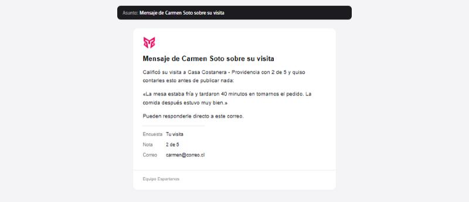
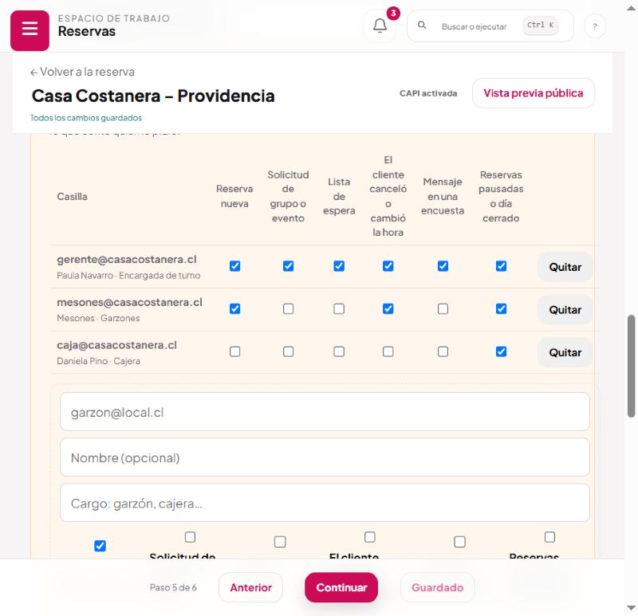
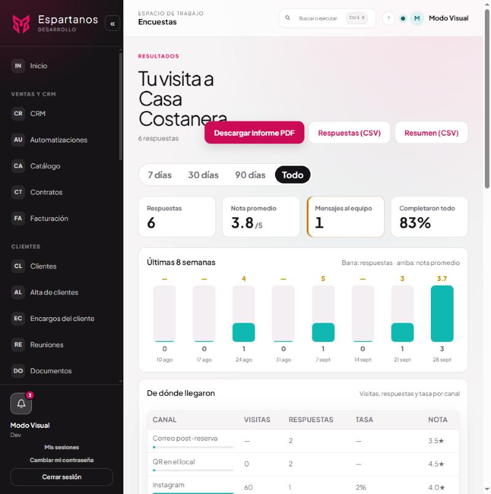
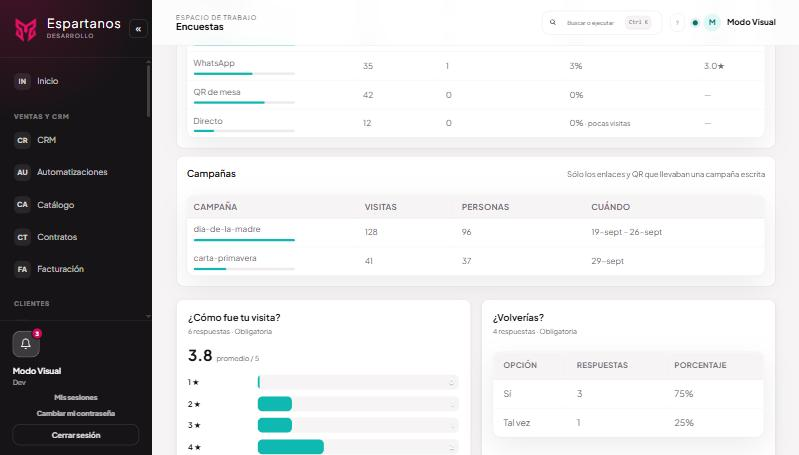
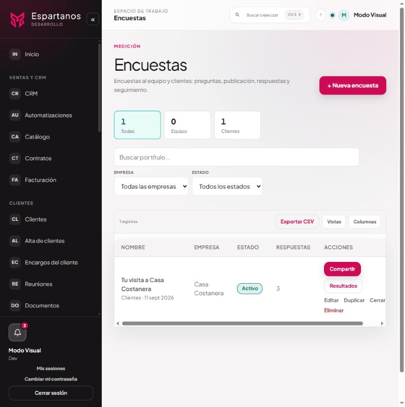
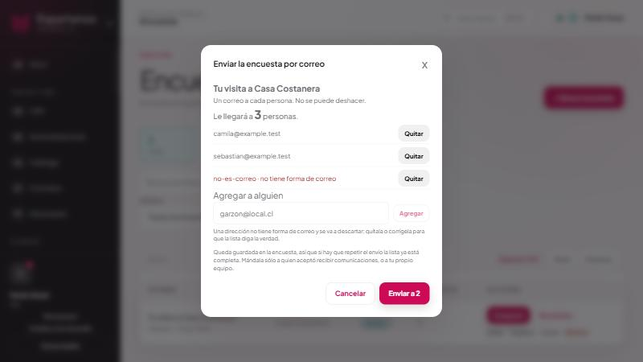
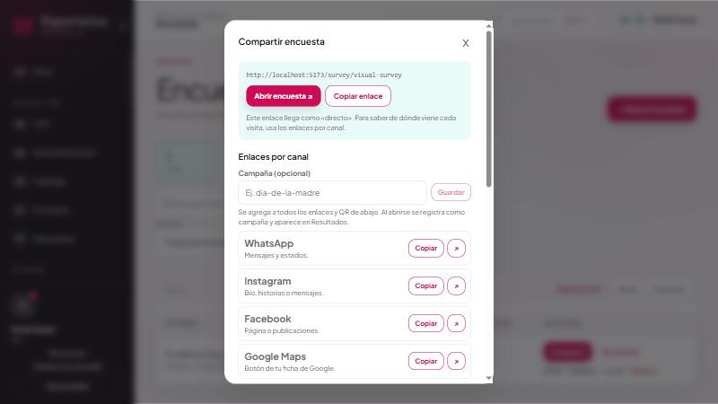
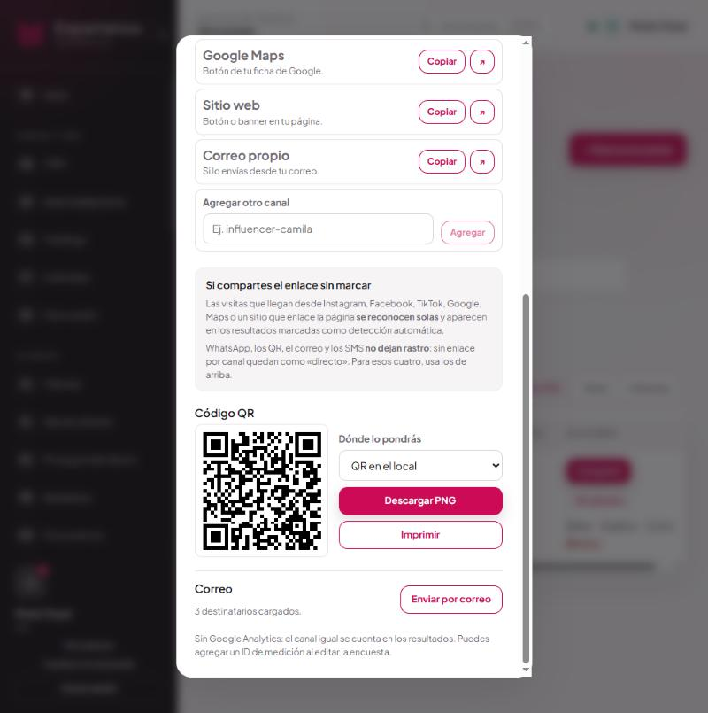
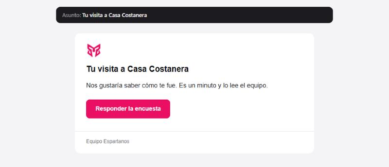

# Encuestas: avisos y correos

Qué pasa cuando alguien escribe un mensaje en una encuesta, a quién le llega, y cómo se manda una
encuesta por correo. **Encuestas**, y **Reservas → el local → «Datos y textos legales»**.

---

## 1 · El caso que esto resuelve

Una persona cena mal, responde la encuesta, pone **2 de 5** y escribe *«la mesa estaba fría y
tardaron 40 minutos»*. Lo escribe esa noche, antes de ir a dejarlo en Google.

Si nadie del local lo lee hasta el lunes, la oportunidad de arreglarlo se perdió.

---

## 2 · El correo que llega



- **El asunto** nombra a quien escribió.
- **El cuerpo** da la nota y el mensaje entre comillas.
- **En filas aparte**: la encuesta, la nota y el correo de quien respondió, si lo dejó.
- **Responder va directo a esa persona**: el local le contesta desde su propio correo sin copiar la
  dirección.

---

## 3 · Cómo se decide a quién le llega

```
Alguien responde una encuesta y escribe un mensaje
   ↓
¿Es la primera vez que escribe algo?       ← corregirlo después no vuelve a avisar
   ↓ sí
¿De qué local es?
   ├── vino de una reserva  → por el formulario de esa reserva
   └── vino de un QR        → por la empresa de la encuesta
   ↓
Casillas del equipo marcadas con «Mensaje en una encuesta»
   +  direcciones del campo antiguo del formulario
   ↓
¿Ninguna? → la casilla de soporte del local, como último recurso
¿Tampoco? → no sale nada. El mensaje queda en Resultados
   ↓
¿Está encendido «Aviso al equipo: mensaje en una encuesta» en Correos?
   └── no → no sale. El mensaje igual queda guardado
   ↓
Sale el correo
```

**El aviso sale una sola vez.** Antes, cada corrección del texto mandaba otro correo: con el límite
de la ruta, hasta veinte por minuto al mismo local.

---

## 4 · Lo que cambió: el QR ahora también avisa

Antes, el aviso **exigía que la respuesta viniera de una reserva**. La primera línea del código
decía: si no hay reserva, no hagas nada.

Consecuencia: **una encuesta abierta por el QR de la carta no le avisaba a nadie.** El mensaje
quedaba guardado en Resultados esperando a que alguien abriera esa pantalla. Y la encuesta del QR es
justo la que más se responde en caliente, en la mesa, mientras todavía se puede arreglar.

### Qué cambió exactamente

| | Antes | Ahora |
|---|---|---|
| Respuesta que vino de una **reserva** | Avisaba | Avisa |
| Respuesta que vino de un **QR** o un enlace | **No avisaba a nadie** | Avisa |
| De dónde salían los destinatarios | Del **formulario de reservas** de esa reserva | De las **casillas del local** |
| Si la encuesta no tiene empresa | No avisaba | Sigue sin avisar: no hay local al que escribirle |

Las casillas del equipo son **del local**, no del formulario de reservas. Con la empresa de la
encuesta ya se sabe a quién escribirle, haya reserva o no.

### Por qué importa justo en el QR

La encuesta del QR es **la que más se responde en caliente**: la persona está sentada en la mesa,
con el problema delante, y escribe. Es también la única oportunidad de arreglarlo antes de que se
vaya. Que fuera precisamente ésa la que no avisaba a nadie no era un detalle: era el caso que más
valía.

Y se nota en los números. En **Resultados → De dónde llegaron**, la fila «QR en el local» suele
tener más visitas que respuestas y una nota distinta a la del correo post-reserva: son dos públicos
distintos respondiendo en dos momentos distintos.

---

## 5 · Dónde se configura



**Reservas → el local → «Datos y textos legales»**, columna **«Mensaje en una encuesta»**
([manual 02](02-casillas-del-equipo.md)).

Normalmente eso es el encargado de turno o la gerencia, no todo el equipo: el mensaje puede traer el
nombre y el correo de quien lo escribió.

### El último recurso

Si no hay **nadie** marcado para encuestas, el aviso va a la casilla de soporte del local —la de
«A dónde llegan las respuestas del cliente»—.

Es un último recurso para que un mensaje con nota baja no se quede sin leer, **no el destino
normal**: en cuanto el local anota a alguien del equipo, deja de usarse.

Si tampoco hay casilla de soporte, no sale nada. **No se cae hacia ningún destinatario inventado**:
escribirle a quien no corresponde es peor que no escribir.

---

## 6 · Dónde queda el mensaje si el correo no sale



**Encuestas → la encuesta → Resultados.** El recuadro **«Mensajes al equipo»** cuenta cuántas
personas escribieron algo. El mensaje se guarda **siempre**, aunque el correo esté apagado o no
haya nadie a quien avisar: el aviso es para que alguien lo lea esa noche, no el único sitio donde
queda.


*Debajo de los canales, lo que trajo cada campaña: visitas, personas distintas y cuándo.*

La tabla **«De dónde llegaron»** dice por qué canal entró cada respuesta —correo post-reserva, QR en
el local, Instagram—, que es lo que permite saber si el QR de la carta está funcionando. Debajo,
**Campañas** separa lo que trajo cada campaña escrita en el enlace.

### Los filtros de Resultados

| Filtro | Qué hace |
|---|---|
| **7 / 30 / 90 días · Todo** | Acota todo lo de abajo: los recuadros, el gráfico, los canales y las respuestas. Las campañas no se acotan: se muestran con su propio rango de fechas |
| **Mensajes al equipo** | El recuadro es también un filtro: tocarlo deja sólo las respuestas que traen mensaje escrito |

Para encontrar un mensaje concreto, baja a la lista de respuestas: están ordenadas de la más
reciente hacia atrás, con la nota, el canal y el mensaje de cada una.

---

## 7 · Mandar una encuesta por correo

Se puede, y **no hace falta que las personas tengan cuenta**.


*Cada encuesta tiene «Compartir» y «Resultados». La columna RESPUESTAS cuenta las recibidas.*


*Quiénes son, con las direcciones sin forma de correo marcadas, y el campo para agregar a alguien sin salir de aquí.*

1. Al crear o editar la encuesta, en el paso de **distribución**, marca **Correo**.
2. Escribe las direcciones separadas por coma.
3. Guarda.
4. Desde la encuesta, **Enviar por correo**.

Sirve igual para una **encuesta al equipo**: escribes los correos de los garzones y la reciben, sin
crearles usuario.

| Condición | Si no se cumple |
|---|---|
| La encuesta tiene que estar **activa** | «Activa la encuesta antes de enviarla» |
| Tiene que tener **Correo** como canal | «Esta encuesta no tiene el correo habilitado como canal» |
| Tiene que haber al menos una dirección válida | «La encuesta no tiene destinatarios con un correo válido» |
| Hay un máximo por envío | Te dice cuántos son y cuál es el máximo |

Al terminar responde cuántos **enviados**, cuántos **fallidos** y cuántos **inválidos** —los que no
tenían forma de correo—. Van uno por uno: si un destino falla, los demás siguen saliendo.


*La campaña se escribe una vez, se guarda y se vuelve a elegir: así no nacen «dia-de-la-madre» y «dia-de-la-madre-2» como campañas distintas.*


*En «Compartir» están los enlaces por canal, el **código QR con Descargar PNG e Imprimir**, y el envío por correo con sus destinatarios cargados.*

El texto sale de la plantilla de Correos, pero **el texto de bienvenida que escribió quien armó la
encuesta manda sobre ella**: es lo que esa encuesta en particular quiso decir.

---

## 8 · La invitación no lleva enlace de baja



Fíjate en el pie: firma y nada más. **No hay «dejar de recibir estos correos».**

Parecía un olvido y no lo es. El artículo 28 B habla de comunicaciones *promocionales o
publicitarias*. Una encuesta no es publicidad: es una pregunta sobre un servicio ya prestado.

Y en una **encuesta al equipo** —que usa la misma plantilla—, un enlace de baja permitiría que un
trabajador se quitara a sí mismo de las comunicaciones de su trabajo, que no es lo que esa casilla
significa.

Lo mismo con el aviso de mensaje en una encuesta: va al equipo del local, es un alerta operativo, y
un enlace de baja ahí dejaría que alguien se apagara los avisos de nota baja de su propio local.

---

## 9 · Encuestas al equipo: lo que las hace distintas

| | Encuesta a clientes | **Encuesta al equipo** (`internal`) |
|---|---|---|
| A quién va | A quien visitó | A quien trabaja |
| Empresa | Se asigna a una | **No se asigna a ninguna** |
| Respuestas | Identificadas si vino de una reserva | Pueden configurarse **anónimas** |
| Enlace de baja | No | No |

Que se puedan configurar anónimas no es un detalle: en una relación laboral, **una respuesta
identificada no es una respuesta libre**.

Una encuesta interna **no se asigna a una empresa**, y el sistema lo rechaza si se intenta: «Las
encuestas internas no se asignan a una empresa».

---

## 10 · Dónde queda cada cosa

| Qué | Dónde |
|---|---|
| La respuesta | `survey_responses`, con `team_message` |
| Los destinatarios por correo | `recipients`, columna JSON de la encuesta |
| A quién avisar | `team_notification_recipients` del local, tipo `encuestas` |
| El texto del aviso | Correos → `email.team_survey_message_*` |
| El texto de la invitación | Correos → `email.survey_invite_*` |

| Acción | Endpoint |
|---|---|
| Enviar la encuesta por correo | `POST /surveys/:id/send-email` |
| Responder (público) | El flujo público de la encuesta |

**Cron:** la invitación automática después de una visita la dispara el trabajo `encuesta-post-visita`
y exige, además, que la reserva esté marcada como **asistida** y que el local tenga una encuesta
elegida. El aviso de mensaje **no depende de ningún cron**: sale en el momento.

---

## 11 · A qué ley responde

**Ley 19.496, art. 28 B — y por qué no aplica aquí.** Exige el enlace de suspensión en
comunicaciones *promocionales o publicitarias*. Una invitación a responder una encuesta sobre una
visita ya ocurrida no lo es, y un aviso al equipo sobre su propio turno tampoco. Poner el enlace
donde no corresponde crea la expectativa de poder darse de baja de algo que es parte del trabajo.

**Ley 21.719, finalidad y minimización.** El mensaje puede traer el nombre y el correo de quien lo
escribió. Por eso se reparte con las casillas por tipo y no a todo el equipo: quien no va a
contestarle no necesita su correo.

**Ley 21.719, consentimiento libre en el ámbito laboral.** De ahí sale la opción de anonimato en las
encuestas internas.

---

## 12 · Preguntas que van a salir

**No me llegó el aviso de un mensaje.**
En orden: que haya alguien marcado con «Mensaje en una encuesta»; que el aviso esté encendido en
Correos; y que la respuesta tenga de verdad un **mensaje escrito** —una nota baja sin texto no
dispara nada—.

**¿Puedo cambiar el texto del aviso?**
Sí, en Correos → `Aviso al equipo: mensaje en una encuesta`. Variables: `{{nombre}}`, `{{local}}`,
`{{nota}}`, `{{mensaje}}`, `{{encuesta}}`.

**¿Llega también si la nota es buena?**
Sí. Lo dispara el mensaje escrito, no la nota. Un «la chica de la barra fue un amor» también vale la
pena que lo lea el turno.

**¿Y si la encuesta no es de ninguna empresa?**
Entonces no hay local al que avisar. Es el caso de una encuesta interna de la agencia, donde el
destinatario natural es quien la creó.

**Corregí el mensaje y no volvió a avisar.**
Es a propósito. El texto corregido sí se guarda.

**¿Puedo mandar una encuesta a gente que no reservó nunca?**
Sí: escribe sus correos en la distribución. Ten presente que eso es tratamiento de sus datos y
necesita su base propia —una relación laboral, por ejemplo—.
