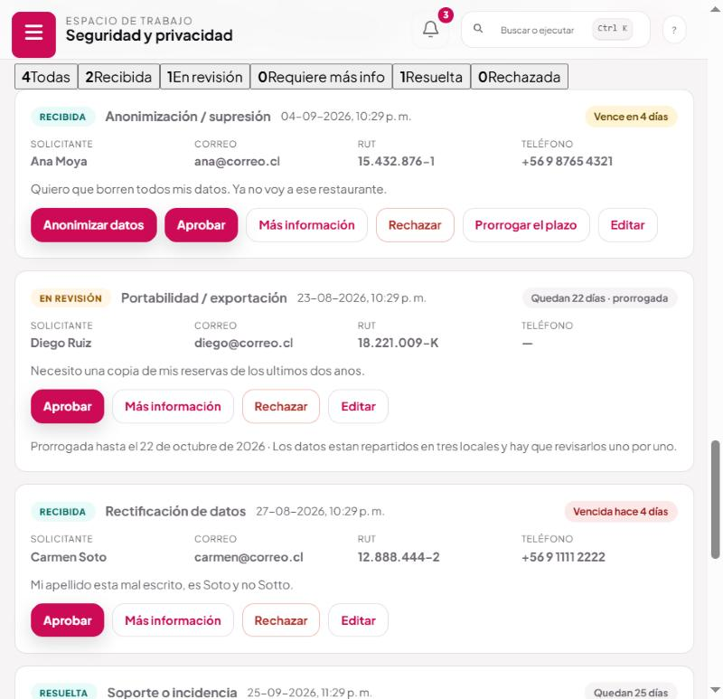
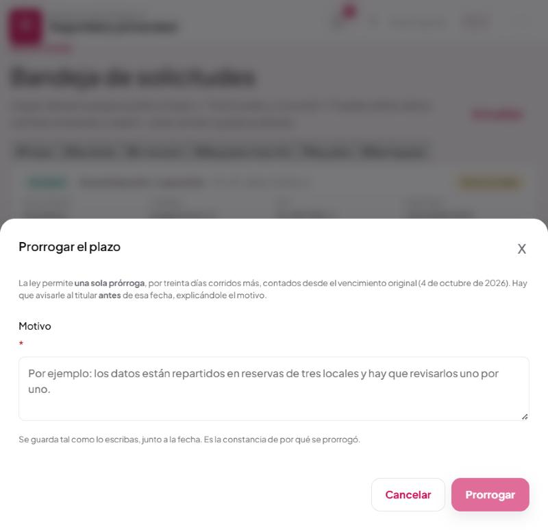

# Solicitudes de derechos

Los plazos legales, la prórroga y los avisos. Administración → **Solicitudes**.

Cuando alguien pide acceder a sus datos, corregirlos o que los borren, empieza a correr un plazo
legal. **Lo que se incumple no es «no responder»: es «no responder a tiempo».**

---

## Los plazos, verificados contra el texto oficial

| Qué | Cuánto |
|---|---|
| Responder una solicitud | **30 días corridos** desde que entra |
| Prórroga | **Una sola vez**, por hasta **30 días corridos** más |
| Condición de la prórroga | Avisar **antes** del vencimiento, explicando el motivo |
| Plazo del titular para reclamar ante la Agencia | 30 días **hábiles** desde la respuesta |

**Corridos, no hábiles.** Cuentan sábados, domingos y festivos. Varias guías comerciales publican
«15 días hábiles» o «3 días hábiles»; **no coinciden con la ley** y no se siguieron.

---

## Cómo se ve ahora

La lista se ordena **por vencimiento, no por fecha de entrada**: lo que hay que mirar primero es lo
que está por vencer, no lo último que llegó.

Cada solicitud muestra en qué punto del plazo está:

| Estado | Qué significa |
|---|---|
| **A tiempo** | Queda más de una semana |
| **Por vencer** | Queda una semana o menos |
| **Vencida** | Se pasó el plazo |
| **Respondida** | Se cerró. El plazo dejó de correr |

---

*Ordenadas por vencimiento. La insignia cambia de color al entrar en «por vencer» y otra vez al vencer. El botón de prorrogar sólo aparece donde todavía corresponde.*

---

## Los avisos

La dirección recibe un aviso cuando una solicitud entra en **por vencer**, y otro distinto cuando
**vence**.

**Una semana antes, no la víspera.** Responder bien una solicitud de acceso toma días: hay que
buscar los datos en reservas, en el CRM, en la lista de correo y en los registros de envío.
Avisar el día antes no sirve de nada.

**Va a la dirección, no a quien la tomó.** Responder una solicitud de derechos no es una tarea
asignable que pueda quedarse en la bandeja de alguien que está de vacaciones.

**No se repite todos los días**, pero cuando una que estaba «por vencer» pasa a «vencida», vuelve a
avisar: es información nueva.

Antes de esto, el plazo estaba escrito en las políticas que el comensal lee y **en ninguna parte
del sistema**. Nadie lo calculaba y nadie avisaba.

---

## La prórroga

Botón **Prorrogar** en la solicitud. Pide el **motivo** y da 30 días corridos más.

*Dice la fecha del vencimiento original, porque es desde ahí que se cuentan los treinta días.*

Tres condiciones, y las tres las comprueba el servidor porque son de la ley:

| Condición | Qué pasa si no se cumple |
|---|---|
| **Una sola vez** | «Esta solicitud ya se prorrogó una vez, y la ley permite sólo una» |
| **Con motivo** | «La prórroga tiene que decir por qué: sin motivo fundado no vale» |
| **Antes de que venza** | «El plazo ya venció, así que no se puede prorrogar. Responde cuanto antes y deja constancia del retraso en la nota» |

La tercera es la que importa. Una prórroga pedida después del vencimiento no es una prórroga: es un
incumplimiento ya ocurrido, con mejor cara. Dejarla pasar daría un papel que dice que se cumplió
cuando no se cumplió, y eso es peor que no tener papel.

**El plazo de la prórroga se cuenta desde el vencimiento original**, no desde el día en que te
acordaste. Prorrogar el día 29 no da más tiempo que prorrogar el día 2: la ley dice «treinta días
más», no «treinta desde ahora».

**Avisarle al titular es tuyo.** El sistema guarda la fecha y el motivo; mandarle el aviso, con la
explicación, lo haces tú. La ley exige que se le informe antes del vencimiento y de forma fundada.

---

## Una solicitud vencida

No deja de haber que responderla: se responde igual, cuanto antes, y se deja constancia del retraso
en la nota de resolución. Una respuesta tardía es mejor que ninguna, y la constancia de por qué se
retrasó es lo que hay que poder mostrar.

---

## Lo que esta pantalla no hace sola

**No busca los datos de la persona.** Eso lo hace quien responde: mirar reservas, CRM, lista de
correo y registro de envíos.

**No borra nada automáticamente.** Hay una acción de anonimizar, y se usa a conciencia.

**No manda la respuesta.** La respuesta se escribe y se manda por fuera, y después se anota aquí
con su nota de resolución.

Es a propósito: una solicitud de derechos la contesta una persona que entendió qué le están
pidiendo. Un sistema que responda solo contestaría mal las que no son estándar, que son justo las
que importan.

---

## A qué ley responde

**Ley 21.719, derechos del titular.** Acceso, rectificación, supresión, oposición y portabilidad,
más el derecho a pedir revisión humana de decisiones automatizadas.

**Ley 21.719, plazo y prórroga.** Recibida la solicitud, el responsable debe **acusar recibo** y
pronunciarse dentro de los **treinta días corridos** siguientes, prorrogables **una sola vez** por
hasta treinta días corridos más.

**Ley 21.719, respaldo de la respuesta.** El responsable debe almacenar los respaldos que permitan
demostrar **la remisión de la respuesta**, su **fecha** y su **contenido íntegro**. Por eso la nota
de resolución importa: es parte de ese respaldo.

**Ley 21.719, derecho a reclamar.** Al responder hay que señalarle que dispone de **treinta días
hábiles** para reclamar ante la Agencia de Protección de Datos Personales.

---

## Preguntas que van a salir

**Alguien pide que le borremos todo. ¿Se borra también que pidió no recibir correos?**
No, y es la única cosa que no se borra. Si se borrara, la siguiente reserva volvería a meterlo en
la lista y se incumpliría el art. 28 B. Lo que queda es una huella irreversible de la que no se
puede volver a su dirección. Ver [el manual 04](04-darse-de-baja.md).

**¿Darse de baja de los correos es una solicitud de derechos?**
No. La baja se hace sola desde el enlace del correo y no abre ningún procedimiento. Son dos puertas
distintas y la página de baja lo explica.

**¿Y si la solicitud llega por WhatsApp o por teléfono?**
Anótala igual en esta pantalla. El plazo corre desde que la persona la hizo, no desde que alguien
la escribió en el sistema, así que conviene anotarla el mismo día.

**¿Cuánto hay que guardar la constancia de haber respondido?**
La recomendación del sistema es **cinco años**, y está fundamentada en
[docs/PENDIENTES-PROTECCION-DE-DATOS.md](../PENDIENTES-PROTECCION-DE-DATOS.md). **Falta que un
abogado lo firme** y que el plazo se escriba en la política de privacidad.
