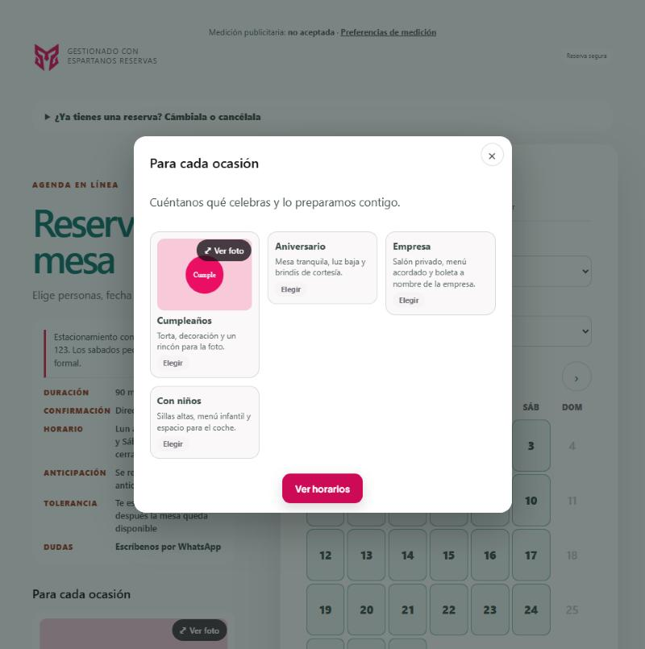
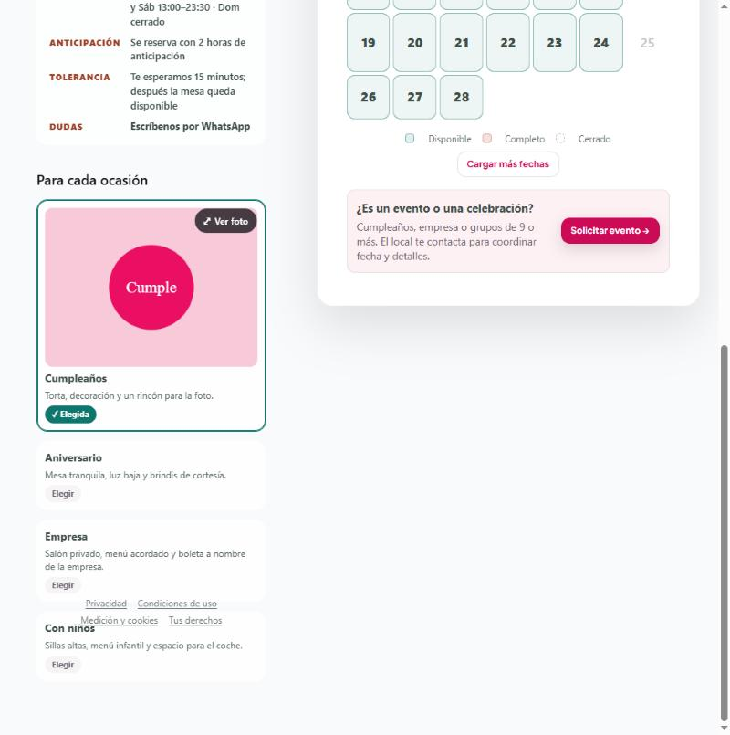

# La página pública de reserva

Lo que ve quien va a reservar, en qué orden aparece y por qué.
**Reservas → el local → pasos «Diseño público» y «Datos y textos legales».**

Es la única pantalla del sistema que ve gente de fuera. Todo lo que aquí se decide mal se paga en
reservas que no se completan.

---

## 1 · En qué orden aparecen las cosas al entrar

```
1. Aviso de medición publicitaria   ← si el local tiene Pixel o GA4
      │ (la respuesta se recuerda en ese navegador, por local)
      ▼
2. Aviso de ocasiones               ← si está encendido, y espera a que se responda el anterior
      ▼
3. La página: personas → fecha → horario → datos → confirmar
```

**El de medición va primero y el de ocasiones espera.** Dos ventanas superpuestas al entrar es peor
que una, y la de consentimiento tiene que ir delante: es la que condiciona qué se puede medir.

Consecuencia práctica, y es la causa de la queja más común: **la primera vez, el aviso de ocasiones
no sale al instante**. Sale justo después de responder el de medición. A partir de la segunda visita
—cuando la respuesta de medición ya está guardada— sale de inmediato.

### Si el aviso de medición no aparece

| Causa | Cómo se comprueba |
|---|---|
| **Ya respondiste en ese navegador** | Es lo normal. Se guarda por local |
| El local no tiene Pixel ni GA4 | Entonces no hay nada que medir y el aviso no corresponde |

Para volver a elegir, el enlace **«Preferencias de medición»** está siempre a la vista, arriba y
también junto a las aceptaciones.

---

## 2 · Las ocasiones



Cada tarjeta hace **dos cosas distintas, con dos controles distintos**:

| Control | Qué hace |
|---|---|
| **Elegir** / **✓ Elegida** | Marca esa ocasión en el formulario. Es lo que el local necesita saber |
| **⤢ Ver foto** | Amplía la foto |



Elegida, la tarjeta lo dice **con palabras** y no sólo con el borde. Antes sólo cambiaba de borde y
la lupa era un icono suelto sin texto: quien la apretaba creía que no pasaba nada, y quien quería
ver la foto apretaba la tarjeta. **Un control que no se explica es un control que no existe.**

Al elegir desde el aviso, el aviso se cierra: ya dijo lo que venía a decir.

### Cómo se configuran

En el paso **Diseño público**:

| Ajuste | Qué hace |
|---|---|
| Encender ocasiones | Muestra el bloque en la página |
| Mostrar como aviso al entrar | Además del bloque, lo abre al entrar |
| Cuántas veces | Siempre, o una sola vez por navegador |
| Título y texto | Lo que encabeza el aviso |
| Botón | El texto del botón que lo cierra |
| **Pregunta asociada** | Qué pregunta del formulario se rellena al elegir |

Si no hay pregunta asociada, las tarjetas son informativas: se ven, pero no se pueden elegir.

---

## 3 · Las aceptaciones


Una obligatoria y tres opcionales, **independientes entre sí**. Cada una con su «Ver detalle», que
despliega el texto legal completo —el mismo que queda guardado como prueba—.

| Casilla | ¿Obligatoria? | Qué pasa si no la marca |
|---|:--:|---|
| Condiciones de la reserva | **Sí** | No puede reservar |
| Beneficios de este local | No | Reserva igual, sin entrar a la lista |
| Beneficios de los demás locales | No | Ídem, para la lista de la red |
| Recordar mis datos en los locales | No | Tendrá que volver a escribirlos en otro local |

Las dos de beneficios están explicadas en [el manual 01](01-beneficios-de-la-red.md).

Hay una quinta, **sólo si el formulario pide datos de salud o alimentación**: el consentimiento
expreso para usarlos. Aparece sola cuando la persona rellena uno de esos campos, y sin ella no se
puede reservar: son datos sensibles y necesitan permiso propio.

---

## 4 · Lo que el visitante puede hacer sin reservar

| Acción | Dónde |
|---|---|
| Buscar o cancelar una reserva suya | «¿Ya tienes una reserva? Cámbiala o cancélala» |
| Pedir un evento o grupo | «¿Es un evento o una celebración?» |
| Anotarse si no hay cupo | Lista de espera, cuando el horario está lleno |
| Leer los documentos legales | Pie: Privacidad · Condiciones · Medición y cookies · Tus derechos |
| Cambiar lo que aceptó para medición | «Preferencias de medición» |

---

## 5 · Un defecto que había, y cómo se nota

La columna de la izquierda queda **pegada** al desplazar, para que los datos del local sigan a la
vista mientras se elige el horario. Eso funciona mientras **quepa en la pantalla**.

Con las ocasiones dentro casi nunca cabe, y entonces pasaba lo contrario de lo que se buscaba: al
bajar, el contenido de esa columna se montaba encima de lo que venía debajo, y **el pie legal
acababa escrito sobre la última tarjeta**.

Ahora, cuando hay ocasiones, la columna deja de quedarse pegada. Sin ellas sigue haciéndolo, que es
cuando aporta.

Si ves textos superpuestos en una pantalla de ancho intermedio —entre tablet y escritorio—, es este
tipo de problema: una columna pegada más alta que la pantalla.

---

## 6 · Dónde queda cada cosa

| Qué | Dónde |
|---|---|
| La elección de medición | `localStorage` del visitante: `vh-medicion:<slug>` |
| Lo aceptado | En la reserva: `*_consent_at`, `*_consent_text`, `*_consent_version` |
| La ocasión elegida | En las respuestas del formulario, en la pregunta asociada |
| Los ajustes de la página | `designConfig` del formulario |

El **texto aceptado lo genera el servidor**, no el navegador: es la prueba, y un texto que viaja
desde el cliente lo puede cambiar quien lo manda.

Lo que se guarda se puede leer después en la ficha de la reserva ([manual 01](01-beneficios-de-la-red.md), §8).

---

## 7 · A qué ley responde

**Ley 21.719, consentimiento informado y granular.** Cada permiso en su casilla, cada casilla con su
texto a la vista, todas desmarcadas de origen y ninguna condicionando la reserva.

**Ley 21.719, datos sensibles.** La salud y la alimentación tienen consentimiento **expreso y
separado**, que sólo se pide cuando esos campos se rellenan.

**Medición y cookies.** El aviso de medición se pide antes de cargar nada de Meta o Google, y
retirarlo surte efecto de inmediato: dejan de enviarse eventos y se borran sus cookies.

**Ley 19.496.** Las condiciones de la reserva, la política de cancelación y la identidad del local
están a la vista antes de confirmar.

---

## 8 · Preguntas que van a salir

**El aviso de ocasiones no sale al abrir.**
Sale después de responder el de medición. Si ya respondiste antes en ese navegador, sale al
instante. Para probarlo de cero, borra `vh-medicion:<slug>` del almacenamiento del navegador o abre
una ventana privada.

**Apreté la tarjeta y no se abrió la foto.**
La tarjeta elige; la foto se abre con **⤢ Ver foto**.

**¿Puedo quitar el enlace de «Preferencias de medición»?**
No. Es lo que permite cambiar de opinión, y eso no se puede esconder.

**Cambié un texto legal y la página muestra el anterior.**
Hay que guardar **y publicar**. La página pública sirve la versión publicada.

**¿La página funciona sin JavaScript?**
No. Es una aplicación; sin JavaScript no hay página de reserva.
