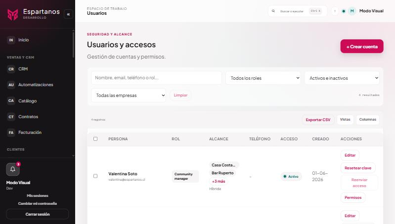

# Cuentas, accesos y qué ve cada quien

Quién entra, con qué permisos, cómo se le crea la cuenta y cuánto le dura la sesión.
**Administración → Usuarios**, y **Administración → Accesos y seguridad**.

---


*Cada fila dice el cargo, qué empresas alcanza y si la cuenta está activa. A la derecha, las acciones: editar, resetear la clave, reenviar el acceso y los permisos finos.*

## 1 · Las dos familias de cuentas

Hay dos mundos y conviene no mezclarlos:

| | **Equipo de la agencia** | **Cuenta de empresa** |
|---|---|---|
| Quién es | Gente de Espartanos | Gente del local cliente |
| Qué ve | Las empresas que tenga asignadas | **Sólo la suya** |
| Cargo | Dirección, Community Manager, Diseño… | `client`, siempre |
| Puede crear usuarios | Según su cargo | No |

Una cuenta de empresa **queda encerrada en su empresa diga lo que diga la dirección del navegador**:
aunque escriba a mano el identificador de otra, el servidor la devuelve a la suya. Y si no tiene
empresa asignada se la rechaza, en vez de darle la de la agencia por descarte: caer hacia la lista
de Espartanos ante un dato que falta es al revés de lo prudente.

---

## 2 · Qué puede hacer cada cargo

Lo que sigue es el reparto en lo que tocan estos manuales. El detalle completo, módulo por módulo,
está en **Accesos y seguridad**, y se puede ajustar persona por persona.

| | Admin | Dir. Comercial | Dev | Community Manager | **Cuenta de empresa** |
|---|:--:|:--:|:--:|:--:|:--:|
| Ver suscriptores | Todos | Todos | Todos | — | **Sólo los suyos** |
| Descargar la lista | ✓ | ✓ | ✓ | — | ✓ (la suya) |
| Importar una lista | ✓ | ✓ | ✓ | — | ✗ |
| Consultar exclusiones | ✓ | ✓ | ✓ | — | ✗ |
| Anotar una petición del SERNAC | ✓ | ✓ | ✓ | — | ✗ |
| Escribir una campaña | ✓ | ✓ | ✓ | — | ✗ |
| **Enviar** una campaña | ✓ con `manage` | ✓ con `manage` | ✓ | — | ✗ |
| Casillas del equipo del local | ✓ | ✓ | ✓ | — | ✓ **(sólo su local)** |
| Enviar una encuesta por correo | ✓ | ✓ | ✓ | ✓ | ✗ |
| Solicitudes de derechos | ✓ | ✓ | ✓ | — | ✗ |
| **Prorrogar** un plazo | ✓ con `manage` | ✓ con `manage` | ✓ | — | ✗ |
| Registro de correos enviados | — | — | **Sólo Dev** | — | ✗ |

### Las tres rejas que atraviesa cada petición

Antes de dejar hacer algo, el servidor comprueba **tres cosas en orden**, y las tres tienen que
pasar:

1. **El cargo.** Si el cargo no alcanza, no hay más que mirar.
2. **El alcance de la cuenta.** Qué empresas tiene asignadas esa persona.
3. **El servicio contratado.** Si esa empresa no tiene Reservas, no se le pueden tocar las casillas
   de su equipo aunque el cargo y el alcance alcancen.

Las tres viven en el servidor, no en la pantalla. **Esconder un botón no es cerrar una puerta**:
una pantalla oculta sigue respondiendo si alguien escribe la dirección a mano, y por eso la
comprobación está donde no se puede saltar.

---

## 3 · Qué tiene el administrador de una empresa

Es el caso que más se pregunta. Una cuenta de empresa, en lo que toca a estos manuales:

**Puede:**
- Ver **su** lista de suscriptores, con la prueba de cada dirección (texto aceptado, fecha, IP).
- **Descargarla** para escribirle por su cuenta desde su propia herramienta.
- Mantener **las casillas del equipo de su local**: agregar al garzón nuevo, quitar a quien se fue,
  decidir qué aviso le toca a cada uno.
- Ver y configurar sus páginas de reserva, sus encuestas y sus resultados.

**No puede:**
- Enviar campañas desde el sistema.
- Ver la lista de otro local, ni la de la agencia.
- Consultar la lista de exclusión ni anotar peticiones.
- Importar direcciones.

**Por qué no envía campañas.** No es desconfianza: **quien aprieta el botón responde de que cada
dirección de esa lista tenga respaldo**, y ese respaldo —el texto aceptado, la procedencia, la lista
de exclusión— lo lleva la agencia. Además todos los correos salen del mismo remitente, así que un
envío mal hecho desde un local le baja la reputación a todos los demás.

**Por qué sí mantiene su equipo.** Es **su** gente. Pedirle a la agencia que agregue a cada garzón
nuevo es exactamente lo que hace que la lista quede vieja y los avisos dejen de llegar.

---

## 4 · Crear una cuenta

**Administración → Usuarios → Nuevo usuario.**

1. Nombre y correo.
2. **Cargo.** Decide qué ve y qué puede hacer.
3. Si el cargo es **cuenta de empresa**, elegir **qué empresa**. Sin ella la cuenta no sirve: el
   sistema la rechaza al entrar.
4. Guardar.

### Qué pasa al guardar

```
Se crea la cuenta con una contraseña temporal generada por el sistema
   ↓
Sale el correo de acceso, con el usuario y esa contraseña
   ↓
La cuenta queda marcada como «tiene que cambiar la contraseña»
   ↓
Al entrar la primera vez, la pantalla la obliga a elegir una propia
```

**Nadie ve la contraseña temporal, ni siquiera quien crea la cuenta.** Se genera, se manda y se
guarda cifrada. Antes había que copiarla a mano y pasársela por chat, que es precisamente como se
filtran.

---

## 5 · Reenviar el acceso

Si el correo no llegó —rebotó, se fue a spam, se borró—, en la ficha del usuario está **Reenviar
acceso**.

| Condición | Qué pasa |
|---|---|
| La persona **nunca eligió** su contraseña | Se puede reenviar |
| Ya eligió la suya | **No se puede.** El botón aparece apagado, y al pasar por encima dice por qué: «Ya eligió su propia contraseña: no hay acceso pendiente que reenviar» |

Que el botón esté a la vista pero apagado es deliberado: esconderlo haría pensar que no existe, y
quien lo busca acabaría reseteando la clave de alguien que no lo necesitaba.

**La contraseña anterior deja de valer.** No se puede reenviar la misma porque está cifrada y nadie
la puede leer, ni el sistema: se genera otra y la vieja se invalida en ese momento.

**Quién puede reenviar:** Dirección Comercial y Dev. Y nadie que no sea Dev puede reenviar el acceso
de una cuenta Dev o Admin.

**El correo no promete un plazo que no existe.** La contraseña temporal **no caduca sola**: vale
hasta que la persona entre y elija la suya, o hasta que alguien vuelva a reenviar el acceso. Decir
«vence en 24 horas» cuando no es verdad hace que la gente no confíe en el resto del mensaje.

---

## 6 · Cuánto dura una sesión

| Qué | Cuánto |
|---|---|
| **Sesión activa** | 15 minutos, y se renueva sola mientras se use |
| **Sesión recordada** | 7 días sin usar la aplicación. Después hay que volver a entrar |

La renovación es transparente: nadie ve la pantalla de entrar por estar trabajando. Lo que corta es
**no volver en siete días**.

Cerrar sesión invalida la sesión de ese dispositivo. Desde **Mis sesiones** se ven las abiertas y se
pueden cerrar las de otros dispositivos — útil cuando alguien entró desde un computador del local y
no volvió a cerrarla.

---

## 7 · Qué correos manda la plataforma a las cuentas

| Correo | Cuándo | ¿Se puede apagar? |
|---|---|---|
| **Acceso con contraseña temporal** | Al crear la cuenta y al reenviar | **No.** Sin él nadie entra |
| **Recuperar el acceso** | Cuando la persona lo pide desde Entrar | **No** |

Son los únicos que no tienen interruptor en Correos, y es a propósito: un sistema donde se puede
apagar el correo que da acceso es un sistema donde alguien se queda fuera sin que nadie sepa por
qué. Tampoco llevan enlace de baja: no son publicidad, son la puerta.

---

## 8 · Dónde queda cada cosa

| Qué | Dónde |
|---|---|
| La cuenta | Tabla `users`: cargo, empresa, si tiene que cambiar la contraseña |
| La contraseña | Cifrada con bcrypt. **Nunca en claro, en ninguna parte** |
| Las empresas que alcanza | `user_client_access`, más la empresa propia de la cuenta |
| Los permisos por persona | `user_permission_overrides`, por módulo y opcionalmente por empresa |
| Las sesiones abiertas | Tabla de sesiones, visible en «Mis sesiones» |
| Quién creó o cambió qué | Bitácora de auditoría |

---

## 9 · A qué ley responde

**Ley 21.719, seguridad.** Hay que adoptar medidas técnicas y organizativas apropiadas. Contraseñas
cifradas, sesiones con vencimiento y permisos por cargo son el mínimo de eso.

**Ley 21.719, minimización aplicada a quién mira.** Que una cuenta de empresa no vea la lista de
otra no es jerarquía: ese dato no le hace falta para su trabajo, y verlo sería un tratamiento sin
finalidad.

**Ley 21.719, responsabilidad proactiva.** La bitácora de auditoría es lo que permite demostrar
quién hizo qué, que es la otra mitad de «cumplir»: no basta con cumplir, hay que poder demostrarlo.

**El correo de un trabajador es un dato personal suyo.** Se trata sobre la base de la relación
laboral y para una finalidad concreta. Por eso las casillas del equipo guardan quién las agregó y
cuándo.

---

## 10 · Preguntas que van a salir

**Creé la cuenta y no le llegó el correo.**
Mira el registro de correos (Dev) para ver si salió y si rebotó. Si salió y no está, casi siempre
es spam. Si no salió, revisa el estado del servidor de correo en Correos.

**¿Puedo ver la contraseña temporal para dictársela por teléfono?**
No, y es deliberado: se guarda cifrada y nadie la puede leer. Usa **Reenviar acceso**, que genera
una nueva y la manda.

**Una persona del equipo cambió de local.**
Cambia su empresa en su ficha. Lo que ya hizo queda registrado con la empresa en la que estaba.

**¿Qué pasa con sus datos cuando alguien se va?**
Desactiva la cuenta en vez de borrarla: deja de entrar y de recibir avisos, y la bitácora conserva
lo que hizo, que es lo que permite explicar decisiones pasadas. Acuérdate de quitarla también de
las **casillas del equipo** del local, que son una lista aparte.

**¿Cuántas empresas puede tener una cuenta de empresa?**
Varias. La suya va primero y no se puede quitar; las demás se asignan. Las ve en el selector de
empresa y cambia entre ellas sin cerrar sesión.
